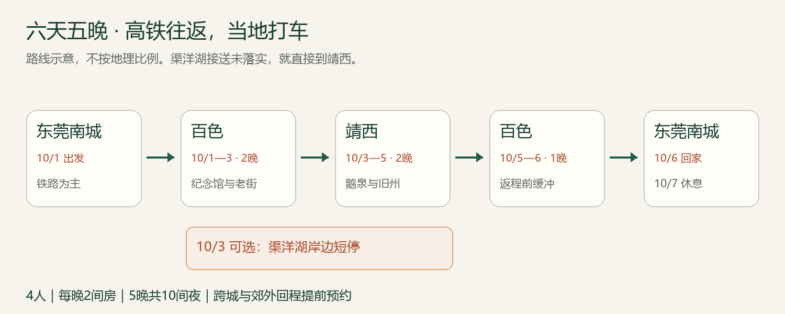
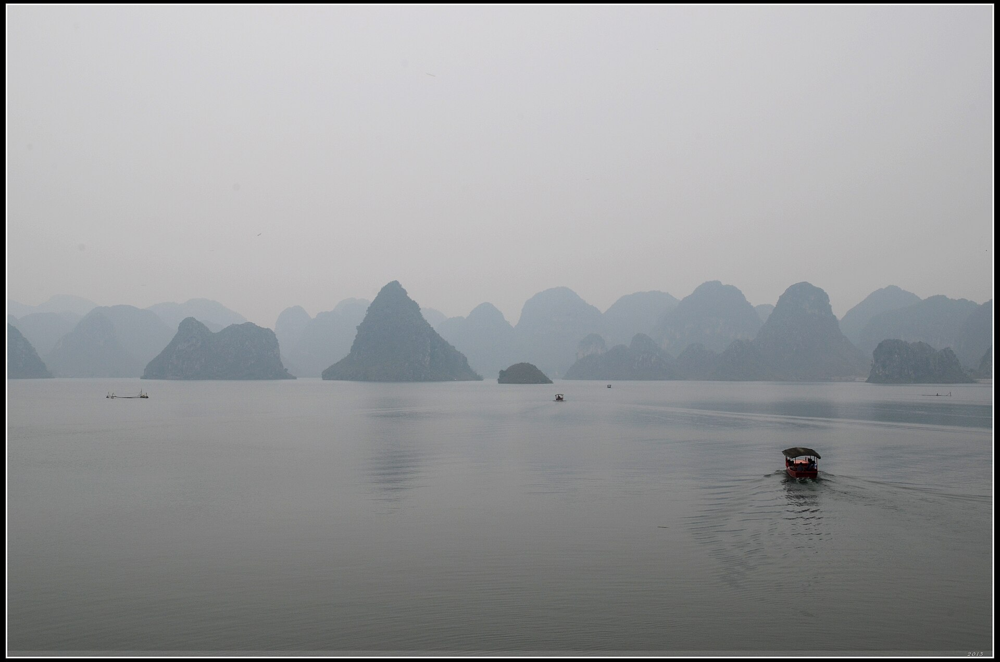
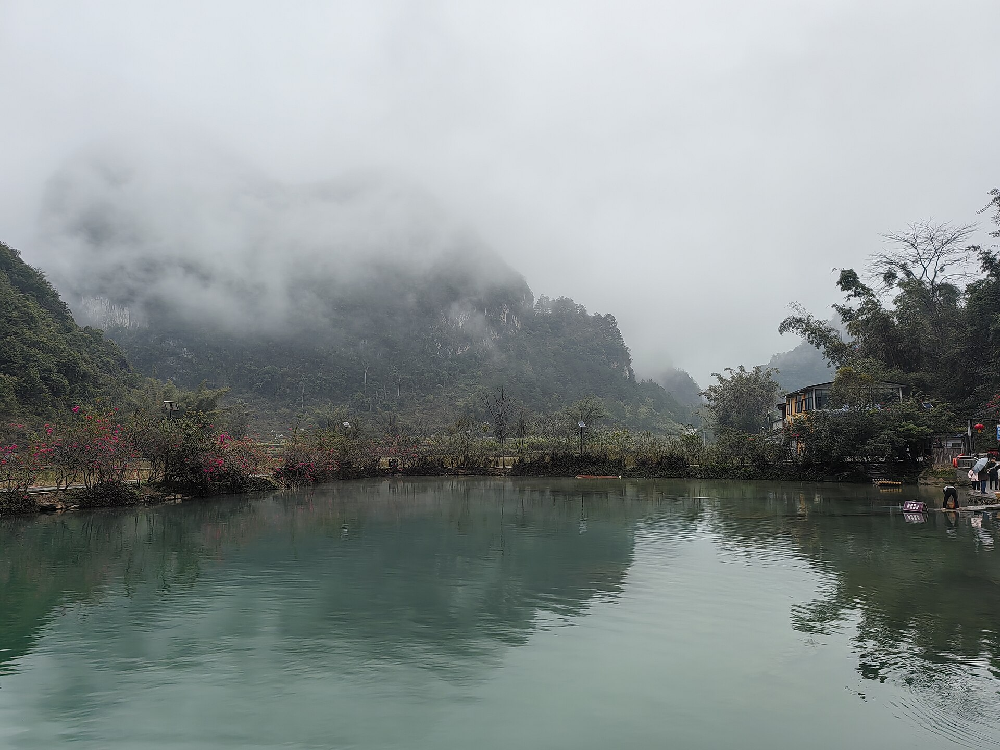
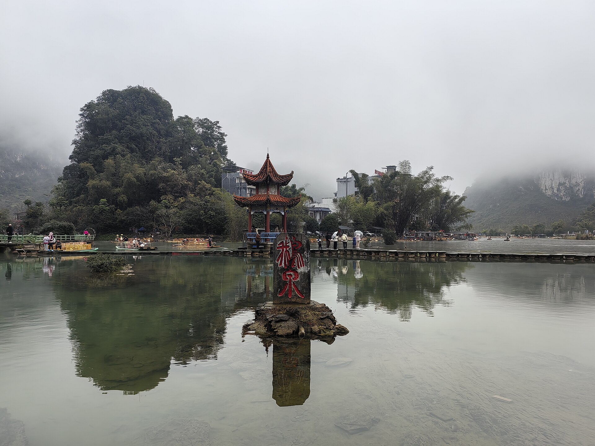
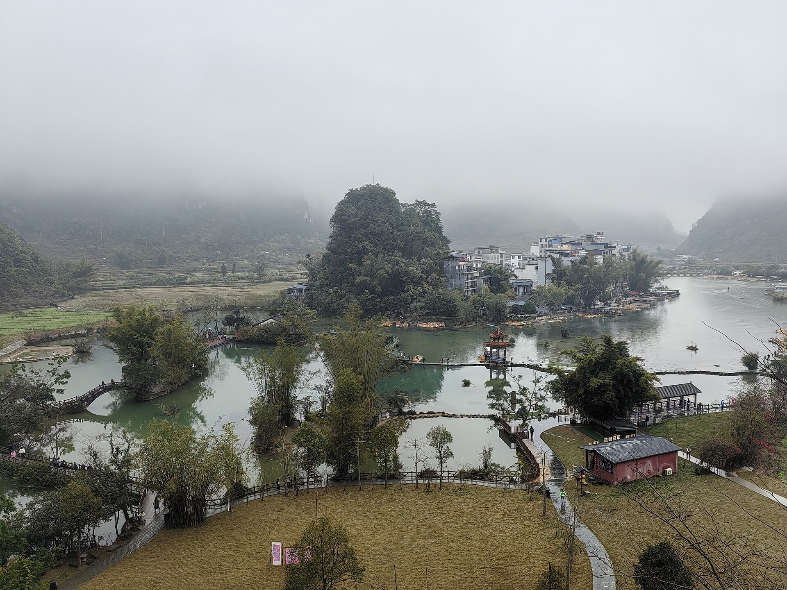
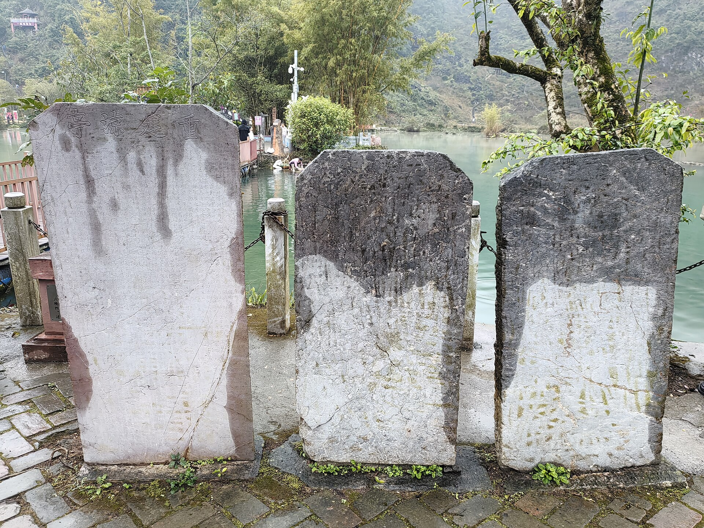

# 百色·浩坤湖·靖西：六天五晚，坐高铁去，当地打车游

**建议日期：2026年10月1—6日；10月7日留在家休息。同行3人：2成人、1名8岁儿童；每晚1间房，共5间夜。** 10月1日D3782广州南→百色已经购买；返程票和酒店未预订。路线、车票状态与酒店初选更新于9月17日；国庆房价、房型库存和景区临时措施仍须在预订时更新，所有未成交金额仍是估算。

主线依次游浩坤湖、渠洋湖、鹅泉。当地打车为主，跨城和乡村接送提前预约；D2不退房，D3带行李游湖后住靖西，D5下午回百色，D6返程。住宿按最新要求改为每晚一间房。

## 六天安排，一眼看懂

| 日期 | 当天安排 | 住宿 |
| --- | --- | --- |
| 10/1 周四 | 南城→西平西→番禺/广州南→百色，到店休息 | 百色，一间房 |
| 10/2 周五 | 08时出发浩坤湖，15时回程，约17时回百色 | 百色，同一酒店 |
| 10/3 周六 | 08:30退房出发，渠洋湖午餐及游览，约17时到靖西 | 靖西，一间房 |
| 10/4 周日 | 鹅泉慢游，午餐后约14:30回酒店 | 靖西，同一酒店 |
| 10/5 周一 | 上午休息，靖西午餐，14时左右回百色、傍晚入住 | 百色，一间房 |
| 10/6 周二 | 百色→广州南/番禺→西平西→南城 | 回家，无第6晚 |

D1长途时刻按已购D3782执行，其余时刻为规划目标，不是实时导航。国庆为10月1—7日，10月7日留在家休息；返程前一天住百色，避开当天跨城接车直接影响长途列车的风险。[假期通知](https://www.beijing.gov.cn/fuwu/bmfw/sy/jrts/202511/t20251104_4258838.html)。

## 下载与使用

DAILY_PDF_LINKS

[下载完整离线攻略 PDF](pdf/baise-family-guide.pdf)。网页适合查导航与来源；每日PDF适合保存在手机里，出门只看当天。费用表中的金额均按全家3人计算，住宿明确按1间房计算；单人票价会另行标注。

## 为什么这样组合

三个山水景点各占一天：浩坤湖从百色往返，渠洋湖放在转往靖西的当天，鹅泉从靖西往返。D2行李留百色酒店，D3行李随车，需要明确保管和等待费；D4回靖西午休，D5午饭后离开。三名乘客坐一辆合规车辆即可，但行李容量仍需按车型确认。

公开国庆游记有鹅泉进村拥堵经历，因此保留早上出发和往返预约。它是历史个案，不代表2026年必然堵车。[游客经历](https://club.autohome.com.cn/bbs/threadowner/c66a6239b6ec39ca/113702185-1.html)。

## 高铁方案：去程已购，返程待抢

**10月1日D3782广州南→百色已经购买，09:43发车、14:53抵达。** 同行人数按本行程3人执行；席别和实付金额没有提供，攻略不把原预算844元写成已支付金额。返程仍按D3804二等座3席准备，10月6日尚未开售，须在9月22日复核开行与时刻。

| 方向与日期 | 优先级／车次 | 乘车区间 | 时刻与耗时 | 状态／成人参考 |
| --- | --- | --- | --- | --- |
| 去程10/1 | **D3782** | 广州南→百色 | **09:43→14:53，5小时10分** | **已购；金额以私人订单为准** |
| 返程10/6 | **主选 D3804** | 百色→广州南 | **10:03→15:26，5小时23分** | 待购；337.50元／人参考 |
| 返程10/6 | 备选1 D3792 | 百色→广州南 | 09:18→14:39，5小时21分 | 待购；337.50元／人参考 |
| 返程10/6 | 备选2 D3812 | 百色→广州南 | 11:46→17:16，5小时30分 | 待购；337.50元／人参考 |

去程“已购”来自用户确认，共享网页不记录订单号、乘车人证件、席位或支付信息。返程价格是9月17日查询的非指定日期参考；儿童金额和10月6日实际销售情况以12306为准。D3804从昆明南开来，在百色上车，勿把昆明南07:15误当本家的发车时刻。[D3782停站](https://trains.ctrip.com/TrainSchedule/D3782)、[返程车次及票价](https://trains.ctrip.com/trainbooking/baise-guangzhounan/)、[D3804停站](https://trains.ctrip.com/TrainSchedule/D3804)。

### 车票行动日历

| 车票 | 时间 | 操作 |
| --- | --- | --- |
| 10/1 D3782广州南→百色 | **已购** | 9月30日在私人订单核对日期、车次、三位实际乘车人、席别和检票信息；不重复下单 |
| 10/6百色→广州南，3张二等座 | **9月22日17:30** | 17:15登录、17:25复核车次和儿童票；先D3804，再D3792、D3812 |

返程日期按通常15天预售期推算，分钟依据9月17日读到的12306起售公告正文。开售前仍在12306“起售时间”按百色站复查，临时调整以12306为准。[官方起售公告](https://www.12306.cn/mormhweb/mobile_zxdt/201411/t20141126_2316.html)、[官方起售查询](https://kyfw.12306.cn/index/view/infos/sale_time.html)。

返程无票时，只选全家能接受的D3792、D3804、D3812二等座候补。12306说明同一候补需求不部分兑现；三人一起提交，不让孩子单独候补。完成预付款后才生效。建议把返程兑现截止设为10月5日20:00，便于前晚确定早餐和送站；这是家庭安排，不是官方截止。本计划没有代登录、提交候补、付款或创建提醒。[12306候补规则](https://kyfw.12306.cn/otn/gonggao/alternate.html)。

### 三人铁路预算怎么算

| 项目 | 计算方式 | 三人合计 |
| --- | --- | --- |
| 长途去程 | 2×337.50＋儿童约169 | 约844元 |
| 长途返程 | 2×337.50＋儿童约169 | 约844元 |
| 西平西↔番禺两次城际 | 三人每程预留80—100元 | 160—200元 |
| **参考合计** | 1688＋160—200 | **约1,848—1,888元** |
| **正式预算预留** | 包含票价变化与取整余量 | **1,900—2,200元** |

儿童约169元仅是以成人337.50元、五折条件成立后向上取整的预算值，不是已查得儿童票价。12306规则还涉及最低票价条件，最终由系统计算。[儿童票规则](https://kyfw.12306.cn/otn/gonggao/children.html)。城际曾有西平西→番禺31元成人票的公开报道，但未核实本次日期现价，所以按三人80—100元／程预留，不把历史价作为确定报价。南城接送站与百色接送站另在出租车预算中，餐饮另列，不重复计算。全程预算相应为**9,500—15,100元**，含每晚一间房及备用金。

### 西平西城际怎样接上主选

去程按06:00左右南城出门、06:30前后到西平西规划，实际地址未知，应按门到站车程调整。选择**最晚08:00抵达番禺**的当日可乘城际，给D3782发车前留103分钟转站、安检和早餐余量；不要押注“最快25分钟”的极限衔接。若9月30日查不到满足08:00前到达的合适城际，直接预约车送广州南并预留国庆拥堵余量。

城际快慢车、当日票与公交化乘车方式和长途固定席位不同；本次没有核实10/1指定C字头班次，因此不编造车次号。9/30按官方实际班次挑满足到达截止的列车，儿童建议由监护人在12306购买儿童优惠票，进站按所购票种选择通道；不要以成人扫码能进站推断孩子也能直接扫码。参考[广州政府城际乘车指南](https://www.gz.gov.cn/zwfw/zxfw/jtfw/content/mpost_9674465.html)，历史指南需结合当天规则使用。

返程D3804 15:26到广州南后，约15:30—16:30出站、转番禺，预计16:30—17:45乘城际回西平西，约18:00—18:30到南城。后三段为接驳预算，不是固定发车时刻。返程选D3812时广州南到站晚1小时50分，回家相应后移，需先核对城际末班。

## 当地打车：哪些随叫，哪些提前约

| 场景 | 执行方式 | 出发前必须落实 |
| --- | --- | --- |
| 百色站、城区酒店和餐馆 | 正规出租车或平台叫车，预留15—30分钟候车 | 正式上客点、行李容量 |
| D2百色↔浩坤湖 | 往返预约两单，或同一合规接送方明确往返等候 | 正式入口、景交换乘、15时接回、等待费 |
| D3百色→渠洋湖→靖西 | 一程约定湖区停留，或两程预约都确认 | 约3小时游览午餐、行李保管、15时离湖 |
| D4靖西↔鹅泉 | 两程提前预约 | 正式入口与13:30回程点 |
| D5靖西→百色 | 下午点到点预约 | 14时酒店出发、百色酒店落客、高速与空返费 |

“打车”为主不等于偏远湖区能随叫随走；无需租车，但跨城及乡村必须预约。报价看含高速费、停车、等待与返空的总价，保留正规订单。普通五座车载司机＋3名乘客，人数可容纳；箱子仍需提前说明。按儿童身高和产品要求配置合适安全约束，预订时询问是否有适配儿童座椅或增高垫，不假定车辆自带。

**可复制的询价文字：**“我们2成人、1名8岁儿童，共3位乘客，行李为实际箱数。10月3日百色酒店出发，11:30左右到渠洋湖正式接待点，午餐和游览约3小时，15时离湖去靖西酒店。请报含高速、停车、等待和返空的总价，确认车型、行李保管、合法上客点及取消规则。”攻略没有替你发送信息。

### 全程道路用车预留

| 项目 | 全家预算 |
| --- | --- |
| 南城↔西平西两次 | 60—140元 |
| 百色站接送及城区短途 | 180—320元 |
| 浩坤湖当日往返 | 600—1,000元 |
| 百色→渠洋湖停留→靖西 | 800—1,200元 |
| 靖西→百色 | 450—750元 |
| 靖西↔鹅泉 | 180—300元 |
| 靖西市内及调度余量 | 130—290元 |
| **合计** | **2,400—4,000元** |

以上全为询价占位，不是运价表或已确认报价；三人乘一车与三人乘一车不应机械打七五折。报价超区间时更新预算、比较正规车辆，不默认删掉已经选定的湖区。

## 住宿：位置和休息条件先于星级

建议百色选择龙景/万景城一带便于用餐和车辆接送的酒店；靖西在锦绣古镇、幸福路和银山颐园三处比较。**10/1—3百色2晚、10/3—5靖西2晚、10/5—6百色1晚**。每个入住夜晚都有3个候选，但同一连续入住段只选一家，不要每天换酒店。

| 城市与候选 | 为什么放进清单 | 下单前特别核对 |
| --- | --- | --- |
| 百色首选：梦之源大酒店（万景城不夜街店） | 4.8分、评论量大；餐饮、洗衣和亲子用品线索完整，适合D1落地和D2早出发 | 所有房型不可加床；必须选家庭房或明确允许三人的双床房。要求非临街、远离娱乐楼层；早餐成人38元，儿童按身高收费 |
| 百色舒适备选：百色温德姆度假酒店 | 房间与亲子设施更适合休息，有室内泳池及儿童池线索 | 确认是否主楼、到电梯距离和三人早餐；成人早餐68元，儿童按身高档；位置和价格通常不如城区候选轻便 |
| 百色经济备选：城市便捷（森林中心城恒基广场店） | 公开页面可见亲子双床房，预算压力较小，周边用餐方便 | 核实亲子房床宽、2成人1儿童入住政策、无烟安静朝向、早餐和国庆库存 |
| 靖西首选：柏曼酒店（锦绣古镇店） | 2024年开业、可见家庭房；近期点评多提到干净、洗衣和周边吃饭方便 | 古镇对面夜间可能有音乐，要求背街高层安静房；入住先核三套用品和卫生，早餐不要默认含3份 |
| 靖西位置备选：维也纳国际（幸福路店） | 幸福路城区餐饮和超市方便，去鹅泉叫车清晰 | 近期点评对烟味、隔音、窗帘、Wi-Fi及早餐有分歧；要求无烟无异味、安静朝向，并确认早餐是否值得预付 |
| 靖西经济备选：雅斯特美途（银山颐园店） | 页面可见家庭房、洗衣和较大房间线索，可作为前两家无合适房型时的备份 | 当前有效点评证据较少，需重新核实房况、叫车位置、早餐、国庆库存与取消期限 |

10月1、2日晚从百色三家中选同一家；10月3、4日晚从靖西三家中选同一家；10月5日晚优先再次订前段住过且满意的百色酒店，但这是相隔两晚的独立订单。以上均未选定房型或核实国庆库存，不以平台默认日期价格充当10月报价。[梦之源](https://hotels.ctrip.com/hotels/16081350.html)、[百色温德姆](https://hotels.ctrip.com/hotels/60196724.html)、[城市便捷](https://hotels.ctrip.com/hotels/13785650.html)、[柏曼锦绣古镇](https://hotels.ctrip.com/hotels/123698014.html)、[靖西幸福路维也纳](https://hotels.ctrip.com/hotels/129067133.html)、[雅斯特美途](https://m.ctrip.com/webapp/hotel/jingxi21417/h758)。

**每晚一间可接待2成人＋1名8岁儿童的房间**，优先询问家庭房或床宽合适的双床房，不默认普通大床房可舒适住三人。下单前核对允许入住人数、每张床宽、是否需加床及费用、儿童早餐、无烟与浴室防滑。按每晚450—800元暂留，5间夜共2,250—4,000元；家庭房或加床实际价格可能更高，以国庆报价更新，不设硬上限。

梦之源平台早餐参考07:30—10:00，成人38元；幸福路维也纳参考07:00—10:00，成人38元；温德姆参考07:00—10:00，成人68元。儿童收费按酒店身高档，8岁不自动免费。订一房先核对订单究竟含几份早餐，早餐不含部分放入餐饮预算，避免重复算。10/6若早车，前晚询问能否打包早餐。

## 门票、预约与年龄优惠

| 项目 | 本家处理 | 出发前核对 |
| --- | --- | --- |
| 浩坤湖 | 2成人＋儿童分别查票种，门票、景交、游船逐项问 | 平台停船公告与8月媒体运营消息不一致；按最新景区答复执行 |
| 渠洋湖 | 岸边接待条件先确认，游船可选 | 实际航线、时长、遮阳、儿童救生衣、末班及三人总价 |
| 鹅泉 | 只查鹅泉使用日票种，不买其他景区组合 | 儿童按实际年龄／身高规则，竹筏是否另外收费 |

所有景区优惠均不能直接套用铁路儿童规则，8岁不代表所有景点免费。全程门票体验预留400—900元，包括门票、景交及酌情选一次正规水上体验；不是两湖游船和鹅泉竹筏全部打包报价，若都参加需另行合计。

[浩坤湖平台信息](https://gs.ctrip.com/html5/you/sight/lingyun1446254/5069278.html)、[渠洋湖](https://you.ctrip.com/sight/jingxi967/1729239.html)、[鹅泉](https://you.ctrip.com/sight/jingxi967/51464.html)。

## 三人全家预算

| 类别 | 六天五晚预留 | 计算口径 |
| --- | --- | --- |
| 铁路与城际 | 1,900—2,200元 | 2成人＋1儿童往返二等座，含广东城际 |
| 住宿 | 2,250—4,000元 | 5晚×1房＝5间夜；三人同住一间 |
| 餐饮 | 1,400—2,200元 | 6天热饭与特色小吃，已含早餐不重复 |
| 出租车与预约接送 | 2,400—4,000元 | 新增浩坤湖往返，含其余全部道路接驳 |
| 门票与体验 | 400—900元 | 门票、景交及酌情一次正规水上体验 |
| 水零食用品 | 150—300元 | 不与正餐重复 |
| 备用金 | 1,000—1,500元 | 调车、改期和价差，并非必然支出 |
| **合计** | **9,500—15,100元** | 三人总额，含备用金，无已支付费用 |

没有固定预算上限；以上为了询价比较，不是实际成交价。儿童票、早餐规则、酒店库存和跨城报价确认后再更新。路线固定为六天，不另加第七天景点。

## 看完社区经验，哪些值得保留

- 浩坤湖网红山顶视角与湖岸线不同，按正式入口和孩子体力走短线；狭窄山路、不明免费入口不作为导航目标。
- 渠洋湖游船评价分歧较大，先确认遮阳、航线和候船时间；喜欢安静观景可以坐，孩子不愿坐则岸边走走。
- 鹅泉先辨明门票与竹筏票，不为无人桥面久等，不把春季花海当十月景色。
- 湖区回城车辆提前落实，历史“有人顺路带回”不能证明国庆运力。
- 餐馆评论少或年代旧时，只留作候选；到店先问营业、出菜和份量，三人从两菜一汤或三菜起点，不照搬多人团餐。

以上为本家规划取舍。可见公开评论与游记均注明来源。9月17日尝试小红书网页端景点搜索，但搜索结果被登录弹窗遮挡，因此只在各景点页提供站内搜索入口，没有把不可见笔记当成已核验经验，也没有转载无许可照片。英文社区样本另在Day 2—4逐条说明；Trip.com自动翻译内容与原始中文内容不视作两个独立样本。

## 行前复查与随身清单

**去程D3782已购：**9月30日在私人订单核对车次、三位乘车人与席位。**现在：**按上述三段各选一家可退、允许三人同住的房型。**9/22 17:30：**抢10/6返程。**9/28—30：**按实际日期复核景区、天气、两城酒店、D2和D3湖区接送、D4回程及D5跨城车。**每天前晚：**核对次日订单与入口。没有创建自动提醒。

天气按出发前7天趋势、前48小时预警和当天景区公告更新。两湖与鹅泉遇雷电、强降雨、停业时取消室外活动，不自动替换成纪念馆，不压缩D5回百色与D6返程缓冲。

随身带3人有效证件、日常药品、轻雨具、防滑鞋、防晒用品、充电宝、水、少量点心及儿童替换衣物。孩子在水边由一位成人明确照看；另一位负责订单与行李，换车重新点数三人及全部包。本人证件、订单、司机私人信息只存私人手机，不写进共享网页。

待补齐：D3782席别与实付金额（只留私人记录）、返程准确车次、一间房房型与退改、儿童身高及景区票种、每程司机确认和集合点。紧急求助120／110，普通出行问题先找景区服务台、酒店或平台。

## 经验信息怎么用

本攻略结合官方线路、运营公告、OTA景区和酒店页面、公开游记与可见评论，形成上述安排；没有登录小红书或抖音账号，也没有把搜索摘要当作完整视频体验。旧无车游记能提示接驳问题，旧票价与班次不沿用。渠洋湖船务评论有好有坏，不能由少数样本推断所有经营者；酒店个别潮味、排队评论只变成订房核对项。详细来源和适用日期保存在研究记录中，平台促销、错地名“鸡西”、野路逃票及“广州南到靖西只需3小时”等不可靠内容均不进入执行路线。

---

# D1 · 10月1日 周四｜东莞南城到百色

**今天只完成顺利到店。** D3782广州南09:43→百色14:53已经购买，按本行程3人执行；席别与实付金额以私人订单为准，不写入共享网页。住百色一间房，第1晚。步行主要在车站，约1.5—3公里估算；行李上下电梯比“景点距离”更影响疲劳。

## 行程时间轴

| 时间 | 安排 | 移动与执行 |
| --- | --- | --- |
| 05:30—06:00 | 早餐、最后检查 | 在家吃好；证件由一成人集中核对，儿童带好小水瓶 |
| 06:00—06:30 | 南城→西平西站 | 预约出租车；30分钟仅作南城内接驳预算，按住址重算 |
| 06:30—08:00 | 城际到番禺 | 选实际班次，预留候车和快慢车差异；目标08:00前到 |
| 08:00—09:43 | 番禺→广州南候车 | 按指示出站、步行、铁路安检；留103分钟衔接和早餐余量 |
| 09:43—14:53 | D3782到百色 | 已购车次；午餐车上解决，轮流照顾儿童与行李 |
| 14:53—16:00 | 出站、打车、办理入住 | 先上洗手间，沿出租车指引到正规候车区 |
| 16:00—17:30 | 一间房休息 | 检查热水、卫生间、噪音；不急着出门打卡 |
| 17:30—18:30 | 酒店附近晚餐 | 有座、出菜快优先，排队超过20分钟换店 |
| 19:00—20:30 | 整理明日物品、早睡 | 如不累，只在酒店附近短走15—20分钟 |

## 车票与预算速查

D3782已经购买，不再查去程候补或重复下单。9月30日在私人订单核对日期、广州南站、三位实际乘车人、席别与检票信息。攻略保留的844元只是原三人预算参考，并非实付金额；城际三人预留80—100元。往返铁路与城际总预留1,900—2,200元，待补实际支付后再更新。[D3782时刻](https://trains.ctrip.com/TrainSchedule/D3782)、[儿童票规则](https://kyfw.12306.cn/otn/gonggao/children.html)。

08:00是番禺目标到达时刻，距D3782发车103分钟。9月30日选择满足此条件的城际；未核实到具体C字头车次，不以“快车25分钟”倒推极限出门。若没有稳妥城际，直接预约车送广州南，并按国庆路况把出门时间继续前移。

## 打车与导航

出发前在地图搜“东莞西平西站”，不是“东莞西站”。城际目的地是“番禺站”，长途票出发站是“广州南站”；两者换乘不能直接当同一个站台。百色站出站后按现场出租车/网约车上客区指示，避免在车流中边走边改定位。

到百色候选酒店：梦之源大酒店（百色万景城不夜街店），龙翔路5号；若改温德姆，用订单全名替换司机目的地。普通五座车可载本家3名乘客，把箱数提前告知。当天广西接站费和南城送站费可预留60—130元，已包含全程交通总盘；站点和酒店改变需重算。

## 社区经验延伸：落地先把休息条件落实

旅行笔记里，小飞在2025年4月行程中遇到过酒店开窗进蚊，夜间影响睡眠；这不是本攻略候选酒店的投诉，也不能推断当地酒店普遍如此，只提醒我们抵达当天做一次简单检查。[原游记](https://siufeikingdom.pixnet.net/blog/posts/9577726776)。

办好一间房后，两位成人分头检查纱窗、空调、浴室和噪声，不合适当时联系前台；孩子先坐休。

晚餐先问“多久上第一道热菜、鸡鸭是否整只起卖、有没有小份”，主食和蒸蛋或豆腐先上，其余慢慢加。到店后赶夜市不是必做项目。

前台顺便问好明天早饭开放时间、出租车正规上客点、能否协助预约10/3跨城接送；对方只能帮忙询价时，就继续等明确承运确认，不把“可以帮你叫”理解成订单已落实。

## 当天美食

午餐：换乘前备好主食，动车上吃盒饭或自带便携餐；全家预留90—140元。晚餐首选候选是**壮家人·壮家菜龙景店**，平台地址锦绣路76号；适合住万景城/龙景片区时短程过去，3人点一份肉菜、一份豆腐或蛋、一份青菜、一份汤再加主食，预留160—240元。点菜先问鸡、鸭是否整只起售和出菜时间；有游客反馈分量较大、鸡类等待较久，别一次点太满。

备选就是酒店餐厅或楼下有座热饭馆；如落地晚或孩子累，直接启用，不为店名多叫一趟车。希望不辣是规划上的便于全家分享建议，尚未确认个人忌口，点菜时说明辣椒另放、不要默认为当地“微辣”等于不辣。[餐厅页面](https://gs.ctrip.com/html5/you/foods/fooddetail/524/16264498.html)。

## 看点与现场提醒

这一天的体验是从珠三角城市群进入桂西，不追求落地后再赶博物馆。长途车上可让孩子看窗外山地和平原变化，约定到站前30分钟收好平板、玩具和外套；不用安排必须完成的学习任务。长途乘坐可在安全条件下适当起身活动，靠近厕所或过道的座位需求以实际选座为准。

车站便利食品适合当午餐补充，但全家不要只吃零食。上午就备好主食、水和纸巾，避免换乘时间不足时临时分头排队。动车晚点抵达18:00以后，就在酒店或楼下吃饭，取消散步和特色餐厅。

## 酒店入住清单

房间优先方便到电梯，需安静而非最靠电梯门；先查看浴室是否有积水、防滑垫是否可用、空调和插座是否正常。确认早餐从几点开始、房价包含几份、儿童是否加价。百色后天退房、10月5日回来再住一晚，可以请前台记下安静房的偏好，但不能把“申请”当成保留房间。

## 晚点、天气与删减

出发前48小时关注广东天气与铁路运行消息；大雨时提前出门，车站内换乘不依赖室外奔跑。若买到广州南更早的车，倒推至少90分钟到番禺，必要时改为虎门接高铁或直接预约车送广州南，而不是压缩到危险换乘时长。买到下午动车，D1顺延并只保晚餐休息，D2照常。

**今晚确认：**浩坤湖10/2开放、当天正式入口、船务与景交状态、往返两程车及15时接回时间。大行李留酒店，不退房。

依据：[广东城际换乘说明](https://pc.nfnews.com/38/8974540.html)、[列车时刻参考](https://trains.ctrip.com/TrainSchedule/D3782)、[12306儿童规则](https://kyfw.12306.cn/otn/gonggao/children.html)。

---

# D2 · 10月2日 周五｜浩坤湖一日，回百色住

**百色酒店出发，当天回同一家酒店，不退房、不搬大行李。** 2成人、1名8岁儿童，住百色第2晚、一间房。今天以正式景区的湖岸观景、廊桥和坐休为主；步行约2—4公里为可缩短的规划量，不安排猪笼洞、天门山登顶或山脊大环线。

## 行程时间轴

| 时间 | 安排 | 移动与执行 |
| --- | --- | --- |
| 07:15—08:00 | 酒店早餐、整理日包 | 大箱留房内；带水、点心、雨具和儿童替换上衣 |
| 08:00—10:00 | 预约车百色→浩坤湖 | 预留约1.5—2小时及国庆弹性；正式集散点由司机当天确认 |
| 10:00—10:30 | 购票、景交与洗手间 | 问清当天开放岸线、回程末班景交、船务状态 |
| 10:30—11:45 | 廊桥与核心湖岸短走 | 每走20—30分钟可停下来；不追求完整环湖 |
| 11:45—13:00 | 正式经营区午餐、坐休 | 餐馆提前问营业与出菜；不是回酒店午睡 |
| 13:00—14:15 | 湖边观景、可选正规游船 | 船停运就继续岸边短线；排队长则不坐 |
| 14:15—15:00 | 向出口返回、景交与接车 | 至少留30—45分钟找出口与候车余量 |
| 15:00—17:00 | 预约车返回百色酒店 | 不等日落；堵车先取消晚间逛街 |
| 17:00—18:00 | 回房休息 | 同一家酒店第2晚，一间房 |
| 18:00前后 | 酒店片区晚餐 | 有余力才短程去文明街吃小吃 |

## 打车与导航

**去程和回程必须在出发前同时落实。** 可在正规平台预约往返两单，或让合规接送方把往返、等待、停车与高速费写进总价。不是租车自驾，也不默认景区门口随叫随走。全家此日道路接送预留600—1,000元，属于国庆询价占位，非实时报价；景交、门票另列。

目的地说清“凌云县伶站瑶族乡浩坤湖景区，当天开放的正式游客集散入口”，不要发网红山顶观景机位。过去资料出现坡贴集散中心、浩高区域等不同位置，须让接送方确认现在私家运营车辆能送到哪里、是否换景交、末班时间。到达时拍合法上客点照片，返回约同一点，14:00再次联系司机。景区网站也提示部分山区网约车稀少，不能由地图上的可叫车图标推断已有人接单。

## 当天美食

早餐在酒店；午餐在浩坤湖正式经营区，三人预留130—200元。暂未核实可靠具体店名，前晚让接送方确认有座位、洗手间、清楚菜单和当日营业。先点一荤一素加蛋或汤，鱼要先写明单价、重量与加工费；不把村内任意民宿都当随到能吃饭的餐馆。

晚餐回百色酒店片区，三人150—220元。若17时左右回到酒店且精神好，可短程去文明街尝卷粉；累了就在楼下吃。候选三和卷粉（平台文明街42号）先点一两份分享，问馅料、酱汁能否分开；平台评价少，不写成必吃。梁氏炖品（平台文明街52号）可见评价多为2019—2020年，页面列17时开门，营业存续需当天确认，排队就放弃。

[三和卷粉](https://hk.trip.com/restaurant/china/baise/detail/restaurant-16105323/)、[梁氏炖品](https://www.trip.com/restaurant/china/baise/detail/restaurant-63483932/)、[2019文明街食记](https://www.sohu.com/a/344653099_327884)。旧食记可用于了解卷筒粉现蒸米皮、包馅的形态，不沿用旧价。甜品三人40—60元以内按需分享，计入全程餐饮预留。

## 看点与现场提醒

重点看峰林层次、湖湾、廊桥倒影和岸边村落。先在游客中心拿当日导览，只选开放的湖岸核心区域，按孩子状态走一段后折返；玻璃桥是否愿走现场决定，不把过桥变成任务。给孩子一个小观察：同一片水在阴影与阳光下颜色有什么不同？不要追着水边动物跑，不下水。

景区网站把核心湖岸与探洞、山顶徒步分别列线，其中猪笼洞涉及垂直洞穴和竹梯，弄外屯相关山路陡窄、完整徒步耗时长。**网上山顶俯拍不等于这条轻松湖岸线随手能拍到。** 本次不为复刻机位改去高山入口；沿途看到临时封路或积水，折返即可。[路线指引](https://haokunhu.com/tour-route-guide)。

## 推荐路线：核心湖岸亲子线，约3.5—4小时含午餐

景区公开路线把“浩高风雨廊桥→玻璃无影桥→湖心岛→渔仙亭→三合屯码头→三合乡村游览区→浩高风雨廊桥”列为适合老人和儿童的休闲步行线。本家采用它的**前半段加原路折返**，不把一圈走完当任务；当天导览或管制与下列顺序不同时，听现场工作人员安排。

1. **游客集散点／景交下客点（10:00—10:30）**：先上洗手间，拍下入口名称、当日导览和返程景交时刻；把15:00接车点发给司机。
2. **浩高风雨廊桥（10:30—10:50）**：第一处必看。站在安全一侧看木桥、湖湾与峰林叠在一起；先拍一张全家合影，后面不用再追同类机位。
3. **玻璃无影桥外围（10:50—11:10）**：只在正式开放且全家愿意时通过。孩子害怕、高空项目另收费或排队超过15分钟，直接沿普通步道前行。
4. **湖心岛／渔仙亭方向（11:10—11:45）**：当天若有连续平缓步道，就走到能同时看湖面、峰林和岸边村落的位置；遇台阶多、湿滑或景交要求折返，提前结束。
5. **三合区域午餐与坐休（11:45—13:00）**：先确认出菜时间和返程方向。三人从两菜一汤或一荤一素一汤起点，不因“湖鱼特色”点超出食量的整鱼。
6. **码头信息核对／可选游船（13:00—14:00）**：只有当天明确运营、航线与儿童救生衣合适才坐；候船超过20分钟，改为湖岸坐看水色。
7. **原路回入口（最迟14:15开始）**：14:30到景交或游客中心，补水、洗手间；15:00上预约车。任何支线都不能挤掉这45分钟。

### 必看、可选与本次明确跳过

| 级别 | 内容 | 现场判断 |
| --- | --- | --- |
| **必看1** | 浩高风雨廊桥与湖湾 | 最容易建立浩坤湖“峰林包围湖面”的第一印象；人多时在桥侧等一轮，不站桥中央久拍 |
| **必看2** | 湖心岛／渔仙亭方向的开阔水面 | 重点看远近峰林、岸线弧度和村落尺度；阴天也值得，水色不必追求网图饱和度 |
| **必看3** | 三合村落与湖岸生活景观 | 只在开放公共区域观察，不进居民院落，不对着居民近距离拍摄 |
| 可选 | 正规游船、玻璃桥 | 两者至多选一项，避免排队把午餐和回程挤掉；现场票种与安全条件不清楚就不选 |
| 跳过 | 猪笼洞、棕榈洞、天坑穿越、十二道拐、30公里环湖骑行 | 公开路线注明垂直洞竹梯、长距离或连续陡坡，不适合本次8岁儿童的轻松一日线 |

### 三个最实用的观景方法

- **廊桥不要只拍桥。** 横向构图把桥放在下方三分之一，后面留峰林和湖湾；全家照先拍，国庆人多时不反复占位。
- **湖岸找前中后三层。** 近处用栏杆、树叶或码头作前景，中间是水面，远处是峰林；这比寻找未确认的“网红山顶”更稳定。
- **给孩子一张观察清单。** 找到“桥的倒影、两种水色、岛与半岛的区别、村落屋顶”四项即可；不靠近无护栏水边完成任务。

## 社区经验与船务冲突，怎样落实

携程可见评论中，“钟灵毓秀”提到网上有大量免票自驾攻略，但本人选择购票游览；“立夏0327”认为景色多样，同时提醒部分道路狭窄、会车困难。这两条页面未展示发表日期，只作为入口和道路核对线索，不能证明国庆管制或具体票价。[公开点评与开放信息](https://gs.ctrip.com/html5/you/sight/lingyun1446254/5069278.html)。

9月17日查询时，携程仍显示“游船停运”公告；8月17日广西新闻网转述的景区消息则称部分船型停运、单层游船等项目可运营。**来源时间和覆盖项目不同，当前不能据此确认10月2日一定有船。** 主行程即使不坐船仍成立。9月28—30日及出发前晚再问景区：具体哪种船开、从哪一码头上下、航程多久、儿童救生衣是否合身、几点停售；不要只问一句“开不开”。[8月17日报道](https://www.gxnews.com.cn/staticpages/20260817/newgx6a82bb57-21981929.shtml)。

平台参考开放时间08:30—17:30、17:00停止入园，不能当国庆承诺；本家15:00离开仍需先核对景交末班。平台的“58元起”不说明对应人数、日期或套餐，**不作为本家已确认门票价**。2成人与8岁儿童分别查实际票种；景交和船票是否包含逐项确认，不按年龄自行判定景区免票。

## 照片怎么参考

可看[浩坤湖景色页面](https://haokunhu.com/en/)及上方携程游客实拍来辨认湖景与山顶视角；图片许可未核实，因此这里保留原站入口，不把照片下载后冒充自由使用素材。攻略内渠洋湖、鹅泉已插入带许可与拍摄日期的真实照片。水色、水位和天气均以出行同周信息为准。

**小红书看图入口：**[搜索“浩坤湖”图文笔记](https://www.xiaohongshu.com/search_result?keyword=%E6%B5%A9%E5%9D%A4%E6%B9%96&type=51)。9月17日实测网页端要求登录后才显示结果，因此没有把不可见笔记写成已核验经验，也没有复制或热链作者照片。出发前可在小红书App重点对比“正式景区湖岸”“弄外山顶”“木棉花观景台”三类画面，先辨认照片对应哪条线路；本家只执行第一类。

## 英文社区视角：把“漂亮”与“适合本家”分开

英文资料数量明显少于中文资料，反而暴露了一个有用问题：外地游客很容易把“浩坤湖景区”和“弄外村网红山顶”混为同一体验。

- [Reddit r/travelchina的一篇2024年经历](https://www.reddit.com/r/travelchina/comments/1hpgo3z)把浩坤湖称为社交媒体热门山顶，作者住湖边民宿后又换交通去徒步，并提醒外国旅客核实住宿接待资格。它证明山顶不是从游客中心顺手走到的点；帖子没有提供适合儿童、国庆运力或正规接驳的保证。
- [英文Tripadvisor页面](https://www.tripadvisor.com/Attraction_Review-g1833724-d1856318-Reviews-Haokun_Lake-Lingyun_County_Guangxi.html)只有1条2017年评论，提到当时有约一小时船游、洗手间和小食摊。样本太旧且太少，只能说明“湖上视角可能有价值”，不能证明2026年船务。
- [英文Trip.com页面](https://www.trip.com/travel-guide/attraction/lingyun/haokun-lake-scenic-area-56807956?locale=en-US)把建议时长列为3—5小时，并有游客认为船上能看到岸上看不到的景色；页面同时混入未经独立核验的山顶攻略。对本家的结论是：船开时可考虑，野山路线仍不采用。

**不同视角带来的修正：**不要因为英文帖子把浩坤湖称为“hidden gem”就低估国庆人流，也不要因为山顶照片最震撼就改变亲子线。真正值得借鉴的是预留半天、确认船务、把住宿／接车资格问清。

## 雨天与接车失败

普通小雨只走正式开放短线；雷电、强降雨、停业或道路预警时取消当天湖区，留百色休息和用餐，**不改回纪念馆参观**。回程司机取消时留在游客中心或有座餐馆，通过平台、酒店或景区协助安排合规车，不带孩子走到偏远公路碰车。当天不把“现场有人说可以接”当落实。

今晚核对D3百色→渠洋湖→靖西的全程接续与等待费、靖西一间房保留到店时间；两只箱子整理好，明早退房。

---

# D3 · 10月3日 周六｜渠洋湖游览，傍晚入住靖西

**渠洋湖是今天的主要游览，不再只是顺路停一小时。** 早餐后退房，行李随预约车，中午和下午在湖区，傍晚入住靖西第1晚、一间房。总道路移动约180—230公里、4—5小时为保守估算，入口与当天导航可能改变结果；湖区留约3小时含午餐，步行约2—3公里可缩短。

## 行程时间轴

| 时间 | 安排 | 移动与执行 |
| --- | --- | --- |
| 07:30—08:30 | 早餐、退房 | 一房逐一检查，洗手间，行李计数 |
| 08:30—11:30 | 百色→渠洋湖正式接待点 | 3名乘客，途中休息15—20分钟；路况需重算 |
| 11:30—12:30 | 湖区午餐 | 确认餐馆营业与座位，不在大太阳下等菜 |
| 12:30—13:00 | 阴凉坐休、看湖 | 午间不安排登高或整圈步行 |
| 13:00—14:30 | 正规游船可选／岸边分段观景 | 含检票候船余量；船务不明确就走岸线 |
| 14:30—15:00 | 洗手间、补水、接车 | 回到事先约定的上客点 |
| 15:00—17:00 | 渠洋湖→靖西酒店 | 不追夕阳；遇堵先保入住与晚饭 |
| 17:00—18:00 | 一房入住、洗澡休息 | 提前通知酒店大致到店时间 |
| 18:00—19:00 | 靖西晚餐 | 酒店周边有座餐馆，饭后自由休息 |

## 两种执行方式，出发前二选一

**A：一辆合规预约接送车，事先约定途中停留。** 司机明确知道不是单纯直达订单，书面确认湖边停多久、在哪里等、午餐是否计等待、总价含哪些费用。以能合法停靠、有厕所和明确接待人员的入口为目标；“坡谷汽车露营地”只能作为与司机核对的候选接待点，不保证当日营业或无门槛进入。

**B：两段分别预约。** 第一段百色酒店→湖区正式上客点；第二段同一上客点→靖西酒店。必须在百色上车前拿到两段确认，分别设置时间并留30—45分钟弹性，不在湖边临时叫远程车。第一段提前到，不等于第二段也能提前来；先联系确认再改变时间。

正常安排是游渠洋湖；仅在天气预警、停业或A/B都无法落实时启用兜底，**直接百色→靖西**：08:30出发，约11:30—12:30到，先吃午饭，酒店到点入住；未到入住时间请寄存行李，不能假定上午就能拿到一间房。下午睡醒后在城区短走，渠洋湖从本次行程中删除即可。

## 游客经验落地：渠洋湖不必追整圈

公开体验有明显分歧：携程2026年7月18日游客认可有遮阳的游船，7月31日和8月2日则有对船务服务的不满；2024年12月另有游客反映实际航线比展示短。不能由这些个案判断所有船或每个班次。[渠洋湖评论页](https://you.ctrip.com/sight/jingxi967/1729239.html)。

痞客邦作者小飞记录2025年4月20日团队行程时，觉得约一小时坐船偏单调、晒；这也提示，喜欢安静看山水与喜欢密集体验的人，感受可能完全不同。[小飞的渠洋湖、鹅泉游记](https://siufeikingdom.pixnet.net/blog/posts/9577726776)。

对本家的具体安排是：

- **岸边短停先问接待条件。** 让接送方确认当天可进入的正式接待点、座位与厕所；不是任意一个“湖边定位”都能下车和休息。没有确认，就走直达靖西分支。
- **不以整湖为步行目标。** 湖岸短走20—30分钟，找一个能看到峰林层次的视角，坐下喝水再决定是否继续。拍好一张合影即可，不沿岸追每个网上机位。
- **行李与等待时间写进订单。** 带行李停湖时，问清司机是否等候、等多久、超时怎么算、行李是否留车。若是分两段车，第二段必须落实，不能用“景点有人就有车”代替确认。
- **临时想坐船，再问五项。** 正规经营主体、实际航线与时长、发船是否等满、遮阳和救生衣、回到哪个码头。3人合计多少钱要当场看清。无法提供儿童合适救生衣或家人不愿坐，就继续岸边方案。
- **船程不是总耗时。** 加上候船、检票和上下船，至少再留30分钟规划余量；这一余量是本家安排，不是景区承诺。最晚14:30结束湖区体验，15:00离开；若等待挤掉午餐或回城余量，不加船。
- **午饭选能及时上桌的菜。** 湖鲜不作为强制体验，先问整鱼重量及是否还有加工费；等待较长就换家常菜。买一大条鱼“多吃几种做法”不一定适合两大一小的食量。

## 推荐路线：码头湖岸＋一次核心体验，约3小时

渠洋湖长约15公里，不适合在百色转靖西当天追求“看完整湖”。本家的路线以**渠洋镇会聚屯正式接待点／当天营业码头**为轴心，先吃饭和确认回程，再在“游船”和“岸边观景”中选择一个核心体验。网上提到的岜旗屯高位机位、南北岸环湖线更适合熟悉路况的自驾者，本次不要求预约司机沿狭窄湖路追点。

1. **正式接待点下车（11:30）**：和司机共同确认15:00上车位置，拍清门头或停车区；行李留在已确认保管责任的车辆内。
2. **午餐（11:35—12:25）**：先问上菜时间。鱼按重量计价时先看活鱼重量和做法总价；不想等就选炒蛋、青菜、豆腐和主食。
3. **湖堤／码头第一观景段（12:25—13:00）**：从有护栏、路面完整的公共区域看湖面、岛屿和峰林倒影。正午光硬，先用肉眼看层次，不急着拍人像。
4. **核心体验（13:00—14:10）**：A线为正规游船；B线为沿码头附近开放岸线分两段慢走。只选一条，避免既候船又追岸线。
5. **最后观景与合影（14:10—14:30）**：找一处能同时收入开阔水面、峰林和岸边村落的位置；拍完即回洗手间和上车点。
6. **14:30结束游览、15:00离开**：30分钟用于排队、步行回车和临时交通调整。不要为等船或追夕阳压缩这段余量。

### A线：船开且条件合适时

- 售票前把“经营主体、总价、实际航线、航行时间、是否等满、上下船是否同一码头、遮阳、三人救生衣”一次问完。
- **必看**是船离岸后岛屿前后错位、峰林倒影、沿岸壮族村落的整体关系；不把某个未经官方确认的石峰名称写成必到点。
- 坐船时孩子坐内侧，成人一前一后照看；不开窗探身、不站起拍照。若太阳直晒，帽子要有固定带，手机加腕绳。
- 实际航线明显短于现场展示或天气转坏时，不与船家争执延长航程；保存票据，按平台或现场正规渠道反馈，14:30仍须离开。

### B线：不坐船时

- 从码头向**路面平整、有人管理的一侧**走15—20分钟，选第一处开阔视角停10分钟，然后原路回；换另一侧再走一小段，全程控制在1—1.5公里。
- **必看**为水中小岛、喀斯特峰林倒影、竹林或村寨点缀的湖岸。阴天看山体层次，晴天看倒影；两者都不需要翻越护栏。
- 不执行30—40公里环湖，也不临时租车或骑行。部分公开经验称北岸狭窄或碎石，这类路况没有为国庆逐段核实，本次留在正式接待区域。

### 渠洋湖必看清单

| 必看 | 为什么值得 | 最合适的做法 |
| --- | --- | --- |
| 开阔湖面与峰林群 | 这是渠洋湖区别于普通水库的主体景观 | 在码头或合法平台看10分钟，先观察山峰在水面形成的远近层次 |
| 岛屿与倒影 | 行船或换角度时，小岛会与后方峰林发生遮挡变化 | 船上坐稳看；岸上用横幅拍摄，不追求贴近水边 |
| 村寨、竹林与湖的关系 | 山水之外仍有生活尺度，画面更完整 | 远观公共景观，不擅入村民院落，不对居民近距离拍摄 |
| 一张三人合影 | 比追十个网红定位更适合本次家庭行程 | 让峰林完整露出，避开正午背光；拍到即可收手机继续看景 |

## 景点实拍：渠洋湖的峰林与水面

摄影：jaysonh · 2013-10-05 · [照片来源](https://commons.wikimedia.org/wiki/File:%E6%B8%A0%E6%B4%8B%E6%B9%96-%E5%B2%9C%E8%92%99%E6%B0%B4%E5%BA%93%EF%BC%8C%E9%9D%96%E8%A5%BF%EF%BC%8C%E5%B9%BF%E8%A5%BF_Guangxi_05-10-13_-_panoramio.jpg) · [CC BY 3.0](https://creativecommons.org/licenses/by/3.0) · 未裁剪或改色。

这是一张2013年10月实拍，适合辨认水库与峰林景观；照片原有边框和署年均保留。云雾、能见度、水位与码头设施会变，不能拿它预判本次天气或今天乘船条件。

**小红书看图入口：**[搜索“渠洋湖”图文笔记](https://www.xiaohongshu.com/search_result?keyword=%E6%B8%A0%E6%B4%8B%E6%B9%96&type=51)。网页端搜索需要登录，本攻略不转载无许可图片。建议在App里分别搜索“渠洋湖码头”“渠洋湖岜旗”“渠洋湖游船”，检查一张照片究竟来自湖面、普通湖岸还是需要额外车辆抵达的高位机位；不要只看封面便要求司机临时绕湖。

## 英文社区视角：有人觉得船最好，也有人宁可不坐

英文独立游记很少，能搜到的内容主要来自Trip.com英文站及其自动翻译社区，不能把不同页面当成完全独立的外国游客样本。不过它们呈现了和中文“必坐船”不同的取舍：

- [英文Trip.com慢游分享](https://qa.trip.com/moments/detail/jingxi-967-146952282?locale=en-QA)认为渠洋湖适合沿湖骑行、看稻田村落和停下来发呆，也明确说可以不坐船。该文的“道路平整、车少”是作者当次感受，不足以覆盖国庆或全部湖岸。
- [另一篇英文页面](https://au.trip.com/moments/detail/jingxi-967-150681812/)突出岜旗高位全景和湖上划船，画面诉求很强，但没有解决本家从百色带行李转靖西时的车辆等待、道路和时间成本。
- 英文页面常把渠洋湖包装为“比桂林更安静的水上峰林”。这有助于理解它的优势是留白和安静，而不是景点密度；若当天阴天、船务混乱或湖岸拥堵，停在一个开阔位置看20分钟仍然完成了核心体验。

**不同视角带来的修正：**本家保留“船／岸二选一”，不把骑行、高位观景台和游船全部塞进3小时。英语内容里的价格、路况和“人少”均不沿用为国庆事实。

## 当天美食

午餐：渠洋湖午餐，前晚请接送方核对接待点附近是否有营业、有座位、明码菜单和洗手间的餐馆；全家140—220元。暂未核验到可靠具体店名，**不写虚构“必吃湖鲜店”**。选现做熟食，活鱼问清单价、计量单位、重量和加工费；不想等待就选蛋、豆腐、时蔬和一份肉菜。若直达靖西，在酒店片区午餐，不刻意停湖边吃。

晚餐候选**壮族人餐厅（靖西店）**，幸福大道幸福广场，平台当前列三楼，旧评论有二楼说法；让酒店核对门店、电梯和接车点。参考平台晚市16:00—21:00，中午可能13:30结束，因此不作为14时抵城时的必然可用午餐。3人预留150—240元，可选蒸蛋、青菜、米饺与一份鸭类；鸭骨较多，孩子部分由成人分好。平台人均不等于本家最终账单。[餐厅页面](https://gs.ctrip.com/html5/you/foods/Jingxi967/16342877.html)。

### D3 到餐厅门口之前

“壮族人餐厅”页面可见的曹操评论说门面不好找、位于商场内，楼层与当前地址栏有差异，且移动页没有显示这条评论的发表日期。因此先请酒店或店方说清当前电梯入口；一家人不在商场里逐层找。抵店后确认当天散客是否正常接待，有没有婚宴导致等待，再决定点菜。[可见评论](https://gs.ctrip.com/html5/you/foods/Jingxi967/16342877.html)。

全家先点一份蒸蛋或豆腐、一份青菜、一份肉菜，加主食；米饺想尝就少量分享，避免再叠加一大份糯米团。醋血鸭、酸甜马肉等菜单特色只供有兴趣的成人自行选择，不强迫儿童以“来都来了”为由尝试。

## 看点与现场提醒

渠洋湖的价值在于山、水和村庄共同构成的开阔视野。选一个正对峰林的合法岸边观景位置，拍全家一张合影，再留10分钟安静看风景，比沿着狭窄环湖路追逐十几个机位更适合这次家庭旅行。选有护栏或宽阔平整平台的位置，看到湖水不意味着可以下水。

现场不使用“只要20元坐私人船”“有野路免费进去”等旧帖办法。游船如临时有兴趣，先核对经营主体、票价、时长、救生衣与天气；一旦要坐，就相应取消其他停留并重约接车。**本版已留可选船务时间和门票体验预留额，但没有确认船价或购买船票**，不把湖岸停一小时写成含一小时航程。

国庆若湖边入口管制，按现场引导，不要求司机在会车困难的地方停车。不要让孩子带行李下车走一公里去堵点另一侧；交通方案不成立就直接到靖西。午餐后返程点应与下车点一致或事先拍照说明，地图里一整个“渠洋湖”不能当接车坐标。

## 费用与行李

今天跨城车含湖停留全家预留800—1,200元，属于询价预算；直达可能更低但没有实时报价。约定高速费、空返费、等待费的处理，平台预估价不含什么要明说。正常候车空档将行李放在酒店或有人看管的车内；司机需要离开时，不能默认帮忙保管整车行李。

## 天气与叫车失败分支

前一晚看到雷电、大雨或道路预警，取消湖；已到湖后天气转坏，立即结束岸边活动，先保证上预约车。不在乡村雨里等待一个未接单的订单。若已确认司机临时取消，第一时间通过平台和酒店安排替代；仍无落实就延后出发，在百色室内等，必要时核实正规客运站当日班次再调整，不将旧帖子班次当兜底承诺。

**今晚确认10/4靖西酒店→鹅泉、鹅泉→靖西酒店两程，核对正式入口、午餐与回程上车点。**

依据：[渠洋湖页面与可见点评](https://you.ctrip.com/sight/jingxi967/1729239.html)、[文旅部靖西路线](https://zhuanti.mct.gov.cn/fymstslvxlzs/xl_detail/9695.html)。

---

# D4 · 10月4日 周日｜鹅泉慢游，下午回靖西休息

**今天只游鹅泉，留足看水、拍照、午餐的时间。** 住靖西第2晚、一间房。步行约2—4公里为可缩短的安排，不要求环走每一处。没有老人同行也不必增加景点数量：8岁孩子可多看鱼、看田园，午后疲劳就直接回房。

## 行程时间轴

| 时间 | 安排 | 移动与执行 |
| --- | --- | --- |
| 07:15—08:00 | 早餐 | 两程车前晚确认，日包带水与雨具 |
| 08:00—09:00 | 预约车靖西→鹅泉 | 包含候车与进村拥堵余量 |
| 09:00—10:15 | 泉水、桥与核心步道 | 正式入口购票，先查当天开放路线 |
| 10:15—10:40 | 坐休、洗手间 | 看孩子状态决定后半程 |
| 10:40—11:30 | 田园方向短走与合影 | 不踩田地，不排长队追无人机位 |
| 11:30—12:45 | 景区经营区午餐、休息 | 点菜前问等待时间，预留完整坐休 |
| 12:45—13:30 | 可选再看一段泉景／直接离开 | 竹筏只有票种清楚、正规救生保障时考虑 |
| 13:30—14:30 | 预约车回靖西酒店 | 回程时间可提前，但先与司机确认 |
| 14:30—17:30 | 回房午睡、自由休息 | 不再安排跨村接送 |
| 17:30—18:30 | 靖西晚餐 | 早点吃，随后核对次日下午回百色车辆 |

## 打车与导航

目的地用“靖西鹅泉景区正式游客入口”，不只写鹅泉村。到达拍下合法上客区照片，回程仍约这里；若改餐馆门口接，先征得司机确认。往返两程全家预留180—300元，非实时报价。时间含节假日弹性，不能据此推断单程路程很远。

12:30再次确认回城车，提前走需沟通，不默认司机随时可到。临时缺车就留在游客中心或有座餐馆等平台、酒店或景区协调，不带孩子在路口晒着等。

## 当天美食

午餐候选**山水人家食庄（鹅泉店）**，平台列焖鸭、豆腐、饭豆芥菜及鱼类等；全家预留150—230元。11:00早点坐下，先问出菜要多久；想尝特色可点水草煎蛋，是否供应以当天菜单为准。鱼类先确认整条价格和加工费，成人帮孩子处理鱼刺；不是每道特色都必须吃。[门店页面](https://gs.ctrip.com/html5/you/foods/fooddetail/967/17506620.html)。

备选为景区正式经营区内菜单清楚、有座的农家菜馆；预留一份面包/点心以防出菜慢，但正餐仍要坐下吃。靖西回城后可少量尝翻叽嘟、五色糯米或山楂糕，1—2样分享即可。晚上清淡家常菜或酒店餐，三人150—220元，不再跨城追店。[地方美食与工艺依据](https://zhuanti.mct.gov.cn/fymstslvxlzs/xl_detail/9695.html)。

### D4 农家菜与路边小吃的取舍

山水人家页面目前仅7条点评，可见用户“缥缈DDD”提到辣子鸡、饭豆炒芥菜和分量；评论具体日期未展示，不能据此证明近期出品稳定。本家可优先询问饭豆芥菜、豆腐等是否能少油少辣，辣子鸡是否预先调味；不能减辣便换菜。[门店可见评论](https://gs.ctrip.com/html5/you/foods/fooddetail/967/17506620.html)。

看中活鱼时，先让店家写明“每斤单价×重量＋加工费”；问米饭、茶位是否另计再下单。若只想尝当地风味，选一个特色菜即可，没必要鸡鸭鱼同时上桌。下午回靖西休息，孩子饿了用随身点心补充，不沿途多次排队。

## 看点与现场提醒

泉眼与不同深浅的水面、桥和村庄、远处峰林是三个观察主题。先问当天开放的连续步道，挑两三个视角即可；不靠跳石过水，不为一张照片挤在湿滑桥面。10月稻田是否金黄取决于种植和收割，春季花海不能作为国庆预期。

## 推荐路线：十五孔桥→泉池→碑刻→田园→观景台，约2.5小时

鹅泉规模不大，重点是同一片泉水在桥面、岸边和稍高视角下的变化。本家从正式入口进出，走连续步道形成短环线；若现场导览方向相反，按单行指示走，不逆行找机位。

1. **正式入口与导览（09:00—09:15）**：先确认开放时间、洗手间、竹筏是否独立收费和回程出口；门票只从正式窗口或正规平台购买。
2. **十五孔桥两岸（09:15—09:40）**：第一处必看。先在桥侧安全位置拍“桥孔＋倒影＋远山”，再步行过桥；桥窄或人多时不在桥中央摆拍。
3. **泉池、鱼群与水草（09:40—10:10）**：沿连续岸线慢走，观察泉水透明度、水草随流摆动和鱼群；是否投喂先看现场规定。
4. **鹅字碑／泉边碑刻（10:10—10:25）**：读一块说明即可，让孩子找出“鹅”字的笔画和普通写法哪里不同；不触摸、拓印或攀靠碑体。
5. **坐休与补水（10:25—10:40）**：此处决定是否上观景台；孩子累了便直接转田园步道。
6. **田园步道与一级观景台（10:40—11:20）**：田埂只走开放步道，不进入种植地。一级观景台能看泉池、十五孔桥、村落与峰林的整体关系；台阶湿滑或拥堵就不上二级平台。
7. **回到出口附近（11:20—11:30）**：补一张全家照，确认午餐位置。竹筏若要坐，放在午餐后12:45—13:25，不与上午主路线争时间。

### 四项必看

| 必看 | 看什么 | 拍摄与亲子提示 |
| --- | --- | --- |
| **十五孔桥** | 半圆桥孔与水中倒影形成连续圆形，远处有峰林和田园 | 最适合从桥侧或对岸拍横幅；桥上只通行，不久站 |
| **泉水、水草和鱼群** | 清澈水体是鹅泉的核心，不同深浅会出现蓝绿变化 | 用偏低角度拍倒影但人留在护栏内；孩子找三种水下形态即可 |
| **鹅字碑与碑刻** | 给纯自然景观增加地方历史线索 | 先读现场说明再讲传说；网络说法与碑文不一致时以现场文字为准 |
| **一级观景台全景** | 一次看全泉池、古桥、村落、稻田和喀斯特峰林 | 只登一级台已经足够；二级台属于体力有余的加项，不作为必达 |

### 竹筏怎样决定

竹筏不是看到推销就上。先完成十五孔桥和泉池主线，再看队伍、天气与孩子意愿。只有正式售票或可核验经营主体、票价和时长写清、三人可同筏、儿童救生衣合身、上下筏有人协助时才选择。若乘坐，重点看水草、桥洞和低视角峰林；全程坐稳，不伸手摸水或在筏上换座。排队超过20分钟、雷雨、风大或午餐已延误，直接取消。

### 最值得拍的三个位置

- **十五孔桥侧前方**：桥孔和倒影占下半部，远山留在上半部；上午若逆光，换到另一岸，不在桥上硬拍。
- **泉池平缓岸线**：手机贴近护栏内侧向下拍水草和鱼，再抬高拍峰林倒影；不跨过护栏求“无边水面”。
- **一级观景台**：用广角收泉池、桥、田园和村落。国庆人多时每家拍一轮就让位，不放飞无人机。

## 游客经验落地：鹅泉的七个现场细节

携程可见2026年6月4日评论提到竹筏票种和门口推销令人困惑；5月4日家庭游客喜欢看鱼、看鹅；5月27日有人觉得不坐筏约一小时便可逛完。8月11日另有游客记录短程筏体验。样本反映不同玩法，并非统一时长、价格或管理结论。[鹅泉游客评论](https://you.ctrip.com/sight/jingxi967/51464.html)。

- **到达先办正式门票。** 拿到票和导览图后再决定附加体验。遇到“坐筏带你进去”的口头套餐，先找正式售票点确认项目与凭证；不把村口报价当景区统一价。
- **竹筏是加项。** 先问按人还是按筏、3人是否同筏、实际时长、上下船地点、儿童救生衣与上下筏协助。门票体验预算只预留酌情选择一次水上项目，不因到场推销增加所有体验。
- **先看水，再决定走多远。** 选一段正式开放的平缓岸线观察水草和鱼；喜欢摄影的成人多停10分钟，其他人可坐休。上午分段游览，含坐休约2.5小时，不要求走满全部区域。
- **不把踏步石当唯一通道。** 小飞2025年4月游记写到类似梅花桩的莲花步道；遇到分离踏石、湿桥或无护栏段，请问工作人员有没有连续步道可绕，不能确认就原路返回。[游记现场描述](https://siufeikingdom.pixnet.net/blog/posts/9577726776)。
- **看鱼鹅可以，喂食先问。** 给孩子安排约10分钟观察活动，喂食仅在景区允许的区域使用允许的饲料；成人陪同站在护栏内。旧帖几元一包的价格不写成当天定价。
- **同一景色只选两三种构图。** 水草近景、桥与倒影、峰林远景已够。人多就拍侧向景，不堵桥、不踩田埂追“无人感”，不为高处全景额外爬坡。
- **演出和稻田看当天。** 有游客遇到过节日节目，但2026十一场次尚未核实。不要为了等演出改晚回程；10月稻田是否已收割也需出发前看同周实拍，春季花田图只作季节对比。

## 景点实拍：鹅泉水色与亭桥

摄影：Yumeto · 2026-02-12 · [照片来源](https://commons.wikimedia.org/wiki/File:20260212_E_Quan_%28102247%29.jpg) · [CC BY-SA 4.0](https://creativecommons.org/licenses/by-sa/4.0) · 未裁剪或改色。

摄影：Yumeto · 2026-02-12 · [照片来源](https://commons.wikimedia.org/wiki/File:20260212_E_Quan_%28103545%29.jpg) · [CC BY-SA 4.0](https://creativecommons.org/licenses/by-sa/4.0) · 未裁剪或改色。

摄影：Yumeto · 2026-02-12 · [照片来源](https://commons.wikimedia.org/wiki/File:20260212_E_Quan_%28112500%29.jpg) · [CC BY-SA 4.0](https://creativecommons.org/licenses/by-sa/4.0) · 未裁剪或改色。这张图能直观看到泉池、步道、村落、田园与峰林的整体关系，也说明阴雾天的水色和远山不会像高饱和宣传图。

摄影：Yumeto · 2026-02-12 · [照片来源](https://commons.wikimedia.org/wiki/File:20260212_Stelae_at_the_E_Quan.jpg) · [CC BY-SA 4.0](https://creativecommons.org/licenses/by-sa/4.0) · 未裁剪或改色。碑面风化、文字不易辨认，现场应看说明牌，不根据网络传说自行解读。

四张均是2026年2月的阴雾天气实拍。既能看到水色，也能看到游人、房屋、步道、全景与碑刻，适合建立现场预期；照片不代表国庆人流或水面一定呈现同样颜色。

**小红书看图入口：**[搜索“靖西鹅泉”图文笔记](https://www.xiaohongshu.com/search_result?keyword=%E9%9D%96%E8%A5%BF%E9%B9%85%E6%B3%89&type=51)。网页端要求登录后查看搜索结果，因此没有截取、下载或热链笔记图片。App内可重点比较“十五孔桥对岸”“泉池水草”“一级观景台”“阴天鹅泉”四组照片；加入“阴天”能减少只看到晨雾、夕阳和滤镜成片造成的预期偏差。

## 英文社区视角：它不是强刺激景点，慢下来才成立

- [Tripadvisor英文页面](https://www.tripadvisor.ca/Attraction_Review-g1575818-d27126448-Reviews-Goose_Spring-Jingxi_County_Guangxi.html)截至本次检索没有该新条目的英文评论，邻近旧条目也只有极少量历史样本。这说明不能用“国际平台高分”替鹅泉背书。
- [英文Trip.com的一篇慢游体验](https://sa.trip.com/moments/detail/jingxi-967-150937837?locale=en-SA)提到出发前看到“半小时逛完、不值”的抱怨，实际体验却认为这里适合慢坐；作者建议竹筏后再步行并登观景台。其当地人套票与价格未经官方核验，本攻略不采用绕售票入口的方法。
- [另一篇英文页面](https://hk.trip.com/moments/detail/jingxi-967-150606968?locale=en-HK)把最佳体验归纳为清晨薄雾、十五孔桥、观景台和田园，并提醒湿滑、防蚊、防晒及避免路边“免费入口”引导。其“早上免费”等说法未获官方确认，本家仍走正式入口。

**不同视角带来的修正：**鹅泉不靠大型项目取胜。若只赶十五孔桥拍照，确实可能觉得半小时足够；本家把看水草、读碑刻、一级观景台和午餐坐休加入后，2.5小时才有意义。竹筏不是“正确答案”，天气、人流和儿童安全不合适就步行。

## 门票与体验

按2成人、1名8岁儿童查10月4日实际票种，携带儿童本人有效证件，核对景区采用年龄还是身高优惠。门票、竹筏分别问清；本日门票体验暂留150—300元，纳入全程400—900元预留，不是已核实套餐价格。任何项目报价超额时先选择是否体验，再更新预算，预算不是硬上限。

## 雨天与体力分支

普通小雨在正式开放区域缩短步行，雷电、强降雨或景区临时关闭则取消室外游览。进村拥堵不通过晚饭后回城来补时；孩子累了，午饭后结束。返回酒店后整理行李；D5下午14:00左右才离开靖西，不必清晨退房。

依据：[鹅泉信息与点评](https://you.ctrip.com/sight/jingxi967/51464.html)、[国庆进村经历](https://club.autohome.com.cn/bbs/threadowner/c66a6239b6ec39ca/113702185-1.html)。平台列景区联系0776-6184467，使用前核对当前官方信息。

---

# D5 · 10月5日 周一｜靖西回百色，给返程留余量

**今天的作用是把跨城风险留在返程前一天。** 不再跑通灵、渠洋湖或远端村落。住百色第3晚、一间房；优先回前两晚的同一家酒店。约150—180公里、3—4小时含休息的道路移动估算；步行约1—2公里，可完全以酒店休息替代。

## 行程时间轴

| 时间 | 安排 | 移动与执行 |
| --- | --- | --- |
| 08:30—09:30 | 睡够后早餐 | 不强制早起；确认酒店早餐结束时间 |
| 09:30—11:00 | 酒店休息或附近短走 | 不新增远郊景点；孩子可补觉 |
| 11:00—12:00 | 整理、按酒店约定退房 | 想晚退先问是否收费，不假定免费到14时 |
| 12:00—13:15 | 靖西午餐、坐休 | 行李可按酒店规定寄存，饭后取回 |
| 13:15—14:00 | 洗手间、取行李、候车 | 一间房和寄存件全部清点 |
| 14:00—17:30 | 靖西→百色酒店 | 约3—4小时含一次休息，国庆需留弹性 |
| 17:30—18:30 | 入住百色、休息 | 第3晚百色，优先回同一家酒店 |
| 18:30—19:30 | 就近晚餐、补路餐 | 到得晚就取消购物，酒店片区解决 |
| 20:00前后 | 核对次日票面和接站车 | 早睡，为D6铁路返程准备 |

## 打车与导航

从靖西酒店大堂门口上车，送到百色酒店而非百色站：明天才坐火车。全家跨城预留450—750元；不把D3去程价格直接当今天报价，方向、供给和返空可能不同。行李和人数提前发给平台/酒店协调车辆，出发前30分钟再次联系。

今天不需要整天车，落客后结束订单。晚饭与购物按需另叫短程车，全部小额接驳已在全程预算中。若司机提出便宜价但要求改为没有订单凭据的私人接送，不必为节省小额费用临时更改已落实方案。

## 当天美食

午餐在靖西酒店附近，三人90—140元；退房后行李按酒店规定寄存，坐下吃完再上14时预约车。傍晚到百色后办理入住。晚餐可重访D1吃得顺口的店，或在酒店餐厅点少量菜，150—230元。同一家再吃一次有助于减少等位和口味试错，无需六天吃六家不同餐厅。

返程点心与水预留60—100元，选少量便携包装；这是水零食类别，别又加进餐饮总额。想买山楂糕或小绣球，以正规店标价、生产日期和实际手工说明为准，不根据“非遗”两个字推断每件都是手工限量。今天购物不是必做活动。

## 看点与现场提醒

上午留给靖西的休息和从容午餐，下午较晚回百色。这里“稍晚”按14时出发、傍晚到店执行，不等到晚饭后才跑跨城公路；当天导航若显示明显拥堵，应适当前移出发。文明街只作为早到且有余力时的晚餐选择，没有补游任务。

购买返程路餐以便携、不易漏汤、不需冷藏为主；干点心、水果少量，容易压坏的鲜食少买。山楂糕、绣球等可先核对生产日期和行李空间；两只中箱能装下，比再多提几袋更有利于明天换乘。

## 返程检查单

核对三张铁路票的日期均为10/6、出发站“百色”、到达站“广州南”，再核对广东城际或虎门接驳。提前预约酒店到百色站，按列车发车前75—90分钟到站目标安排；拿到准确车次后重写出门时间。一间房早餐若不赶得上，问能否打包或自己准备，不把没确认的打包早餐当已含服务。

充电宝放随身包，按铁路现行携带要求核对标识与容量；剪刀等物品行前确认能否携带。孩子的证件、日常药、充电线不要放到大箱最底层。两位成人一位管车票和孩子，一位负责行李计数，上下车都数三人和全部包。

## 延误或叫车失败

前晚发现车辆未落实，先通过正规平台与酒店重新确认；必要时研究客运站当日班次，把百色到店时间向后移，但不新增上午景点。遇道路临时中断，立即比较可运营的正规客运方案与酒店续住条件；当天尚有缓冲，不要深夜才开始处理次日列车衔接。

若到百色已晚于18:30，取消购物；若很疲劳，晚饭送到酒店或楼下解决。遇明显不适应以休息和及时求助为先，不为完成攻略强行赶路。今天的最优结果就是全家睡好，明天从百色从容离开。

依据：跨城时间为行程预算，出发前用实际酒店与实时地图复核；[百色至广州南列车查询入口](https://trains.ctrip.com/trainbooking/baise-guangzhounan/)。

---

# D6 · 10月6日 周二｜百色到东莞南城

**今天只返程，不在车站前插入景点。** 主选D3804：百色10:03→广州南15:26，二等座3席；备选D3792 09:18→14:39、D3812 11:46→17:16。按现行时刻表选定，10/6尚未开售，9/22 17:30复核并购票，尚未出票。今天无住宿，10/7留在家里整理行李和休息。全程门到门约8—10小时估算，遇晚点相应顺延。

## 行程时间轴

| 时间 | 安排 | 移动与执行 |
| --- | --- | --- |
| 06:45—07:30 | 早餐、检查一间房 | 按实际车次调整，衣柜和插座再看一次 |
| 07:30—08:30 | 退房、预约车到百色站 | 提前确认上车位置与箱数 |
| 08:30—10:03 | 安检、候车 | 主选留出约93分钟；在站内上洗手间、接水 |
| 10:03—15:26 | 动车到广州南 | 主选D3804，现行5小时23分；午餐在车上 |
| 15:26—16:30 | 广州南出站、转番禺 | 找好出口与城际入口，按现场标识，先休息再换乘 |
| 约16:30—17:45 | 番禺→西平西 | 快慢车、等候不同，留弹性；不写死某趟城际 |
| 约17:45—18:30 | 打车回南城 | 实际到西平西再更新定位；不提前让司机空等 |
| 到家后 | 简单晚餐、洗漱 | 无采购任务，结束行程 |

## 返程抢票与预算

**9/22 17:15登录、17:25核对、17:30抢票。** 输入10/6百色→广州南，主选D3804，无票则将D3792、D3812二等座按实际可接受时间加入候补。候补3人同一需求，完成预付款后才生效；本家建议10/5 20:00截止，前晚确认结果，不能把候补当已购票。没有创建自动提醒或代下单。[官方起售公告](https://www.12306.cn/mormhweb/mobile_zxdt/201411/t20141126_2316.html)、[候补规则](https://kyfw.12306.cn/otn/gonggao/alternate.html)。

长途三人参考约844元，返程城际预留80—100元；儿童169元是取整估算，成人337.50元为现行平台快照，实际10/6票价开售时核对。往返铁路总预算1,900—2,200元，打车另计。[D3804时刻](https://trains.ctrip.com/TrainSchedule/D3804)、[返程票价参考](https://trains.ctrip.com/trainbooking/baise-guangzhounan/)。

D3804是途经百色列车，现行09:59到、10:03开，不在站台临时找证件和整理箱子；到站后按检票指引候车。改选D3792需把酒店出发前移45分钟；改选D3812则回家大致后移1小时50分，先核对广东城际末班。

## 打车与接驳

百色酒店到站预留30—60分钟含叫车、道路和下客，按酒店距离重算。**约车出发时间=列车发车时间−到站提前量75—90分钟−道路时间及候车余量**，不能机械照表08:00。百色站高铁与其他铁路服务以票面和现场指引为准，确认进站口，不让司机把你送到不开放一侧。

广州南回东莞继续优先番禺城际；如果当天合适班次是经虎门的铁路组合，应提前在买票时确定并留充足换乘，而不是动车到站后才临时找三个座位。若改广州南直接打车回南城，先看道路拥堵和报价，单独增加预算；晚点时不能默认公路一定更快。

## 当天美食

早餐按酒店含餐和列车时间决定；若无打包服务，前一天自备简餐，不能到08:00才发现餐厅未开。车上午餐全家90—140元，准备适量水果与水，避免汤汁多、气味重、容易洒的食物。到广州南若需等候较久，先找座位休息，再买少量补充餐。

到家晚餐按清淡热饭安排，全家90—150元参考。当天不再安排返程后去网红餐厅；如晚点在广州吃过饭，家里简单收尾即可。每日餐费区间是选择空间，最终统一纳入六天全家1,400—2,200元总盘，酒店已含早餐不再重复计费。

## 看点与现场提醒

返程在百色提前住一晚，已经省去清晨从靖西追长途列车的紧张。早餐吃够、车上带水，孩子旅途中睡一觉即可；不为了买最后一份卷粉让三个人一起晚退房。旅行里最需要按时完成的是车站衔接，其余都可放弃。

最后到站前让两位成人分别检查座位下、行李架、充电口和座椅背袋。出站到换乘区全家一起行动，不在大型车站让儿童跟着另一家人走，行李由成人负责，不让孩子独自走散。

## 晚点或错过接驳

长途动车晚点，先在官方渠道查看后续车次及退改规则，把广东城际接驳更新为实际可乘的班次。没有固定席位的接驳也可能受末班、限流和运营调整影响，不承诺“随到随走”。若铁路后续无法衔接，再比较合法预约车直接回南城或在广州过夜；对家里孩子而言，不应以深夜连续转车为默认方案。

如出发前一天已经收到停运或明显天气影响，按官方通知处理票务及酒店变更；不要继续照旧时间轴。交通退改按订单条款办理，价格表中的备用金就是为这种改变留的。

## 当天支出与结束清点

百色送站加西平西接回南城，全家预留60—130元；铁路和城际票已在总预算单列。车上餐饮与回家简餐另按当天实际消费；没有第6晚酒店。回家后记录实际花费即可，不需要当天晚上整理照片或补完成任何景点。

