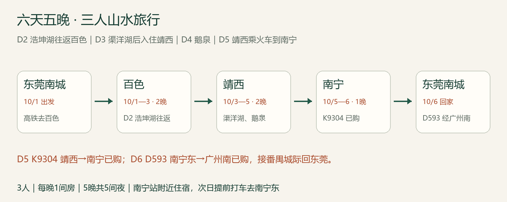
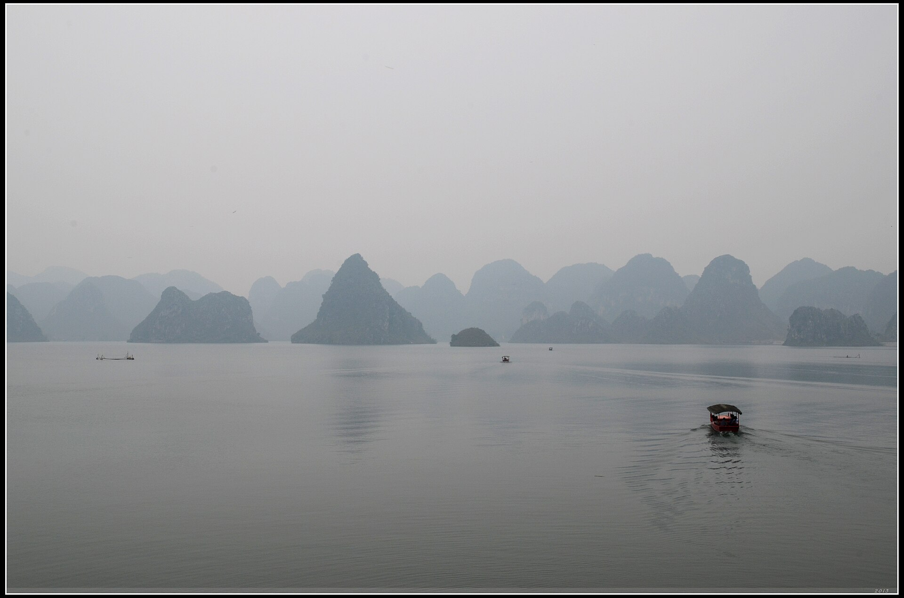
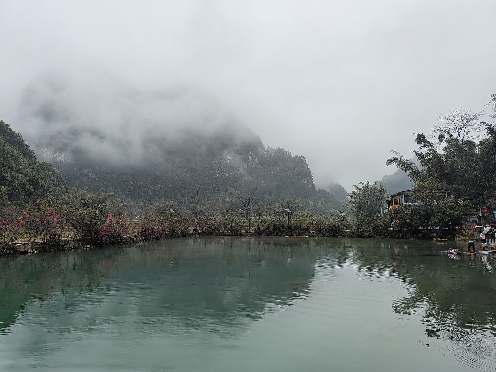
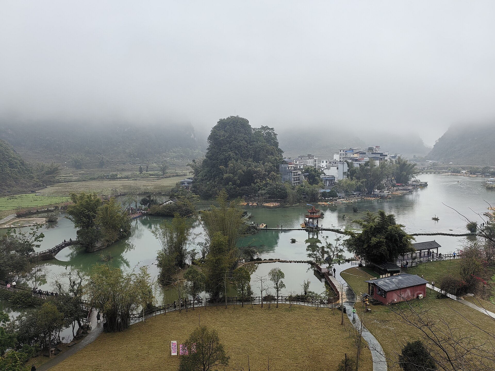

# 百色·浩坤湖·靖西·南宁：六天五晚旅行执行版

**2026年10月1—6日，2成人＋1名8岁儿童，每晚1间房。** 长途以铁路为主，当地打车或预约接送。已购S4742、D3782、K9304、D593；已订百色2晚、靖西2晚。当前待办为番禺→西平西返家接续、南宁站附近1晚住宿和景区／送站接送。D593从南宁东出发，需从酒店跨城区送站；未报告实付的项目仍保留预算占位。

## 六天天气速查

**查询于2026年09月28日 06:50（北京时间）。这是预报快照，不会自动刷新。** 10/1—4采用中国天气网7天预报；10/5—6采用该站8—15天客观趋势产品，温度和雨势可能明显调整，出发前必须刷新。市县预报只作湖区参考，表中温度为全天最低至最高，不是到访时段温度。

| 日期与地点 | 天气、温度 | 预报类型 |
| --- | --- | --- |
| 10/1 东莞→广州→百色 | 东莞25—33℃雷阵雨；广州24—33℃雷阵雨；百色24—29℃中雨转阵雨 | 7天预报 |
| 10/2 百色↔浩坤湖 | 凌云21—27℃、阵雨；百色24—30℃、阵雨 | 7天预报 |
| 10/3 百色→渠洋湖→靖西 | 靖西22—28℃、阵雨；百色24—30℃、阵雨 | 7天预报 |
| 10/4 靖西↔鹅泉 | 靖西22—28℃、阵雨 | 7天预报 |
| 10/5 靖西→南宁 | 靖西16—19℃、雨；南宁18—23℃、雨 | 趋势参考 |
| 10/6 南宁→广州→东莞 | 南宁18—23℃雨转多云；广州18—24℃晴；东莞19—24℃多云 | 趋势参考 |

**怎么准备：** 夏装为底，随身带薄长袖／薄外套、轻便雨衣、防滑鞋、儿童替换衣袜及装湿衣的袋子。湖区遇普通阵雨缩短岸线；出现雷电、强降雨或关闭公告，执行各日已有的取消／返店方案。当前预报不作为已经停运或闭园的证明。

**复核节点：** 9/30晚重新看全程；每天20:00查次日小时预报和属地预警，出门前再看一次。D2查凌云及浩坤湖当地，D3—4查靖西；D6同时查南宁、广州、东莞。不要用百色市区天气替代三个湖区，不根据图标猜上午／下午何时停雨。

官方更新入口：[百色](https://www.weather.com.cn/weather/101301001.shtml)｜[凌云](https://www.weather.com.cn/weather/101301011.shtml)｜[靖西](https://www.weather.com.cn/weather/101301005.shtml)｜[南宁](https://www.weather.com.cn/weather/101300101.shtml)｜[广州](https://www.weather.com.cn/weather/101280101.shtml)｜[东莞](https://www.weather.com.cn/weather/101281601.shtml)；中期趋势：[靖西](https://www.weather.com.cn/weather15d/101301005.shtml)｜[南宁](https://www.weather.com.cn/weather15d/101300101.shtml)｜[广州](https://www.weather.com.cn/weather15d/101280101.shtml)｜[东莞](https://www.weather.com.cn/weather15d/101281601.shtml)。逐日执行建议见每天的“天气与当天调整”。

## 出发前先完成这5件事

| 优先级 | 事项 | 最晚处理与执行标准 |
| --- | --- | --- |
| **1** | 核对已购D593，并选番禺→西平西接续 | D593票面时刻与实付待补；城际优先15:45左右或更晚直达，尽量留90分钟换乘，尚未购票 |
| **2** | 预订10/5南宁站附近1间房 | 优先约500米范围；核对三人入住、早餐及退改，预约10/6约08:45送南宁东 |
| **3** | 落实10/2百色↔浩坤湖往返车 | 两程都确认；写明正式入口、15:00接回、等待费及总价 |
| **4** | 落实10/3百色→渠洋湖→靖西 | 写明湖区停留约3小时、行李保管、15:00离湖及含费总价 |
| **5** | 落实10/4靖西↔鹅泉 | 前晚确认08:00出发、13:30接回、正式入口和上客点 |

DAILY_PDF_LINKS

[下载完整离线攻略 PDF](pdf/baise-family-guide.pdf)。出行当天优先看对应日期PDF；车票、门票、酒店和天气最终以私人订单、12306及现场公告为准。

## 六天速览

| 日期 | 核心安排 | 住宿 |
| --- | --- | --- |
| **10/1** | 南城→S4742西平西→番禺→D3782广州南→百色 | 梦之源大酒店，已订第1晚 |
| **10/2** | 08:00去浩坤湖，15:00接回，约17:00回百色 | 梦之源大酒店，已订第2晚 |
| **10/3** | 08:30退房→渠洋湖午餐与游览→约17:00到靖西 | 尚客优酒店，已订第1晚 |
| **10/4** | 08:00去鹅泉，午餐后约13:30返程 | 尚客优酒店，已订第2晚 |
| **10/5** | 退房→K9304靖西→南宁站→近站酒店 | 南宁站附近，待订 |
| **10/6** | 08:45酒店出发→D593南宁东→广州南→番禺城际至西平西→南城 | 回家 |

## 铁路与关键接续

| 日期 | 车次与区间 | 参考时刻 | 状态与费用 |
| --- | --- | --- | --- |
| 10/1 | **S4742 西平西→番禺** | 公开参考07:50→08:27 | **已购**；三人实付待补 |
| 10/1 | **D3782 广州南→百色** | 09:43→14:53 | **已购，三人843元** |
| 10/5 | **K9304 靖西→南宁** | 公开参考约08:32→11:53—12:00 | **已购，三人109元**；按私人票面执行 |
| 10/6 | **D593 南宁东→广州南** | 公开参考11:28→14:13—14:14 | **已购**；实付和准确票面时刻待补 |
| 10/6 | 番禺→西平西直达城际 | 15:15以后，优先15:45左右或更晚 | **待选／未购**；三人暂留80—100元，班次按10/6实际查询 |

**10月1日接续重点：**计划07:00前到西平西。S4742公开参考08:27到番禺，距离D3782发车约76分钟；下车后直接按指示前往广州南、安检和检票，不安排购物或早餐。9月30日从私人订单再次核对S4742准确时刻、三位乘车人和检票方式。[S4742参考](https://www.gaotie.com.cn/checi/S4742.html)｜[D3782参考](https://trains.ctrip.com/TrainSchedule/D3782)｜[D593参考](https://trains.ctrip.com/TrainBooking/nanningdong-guangzhounan)

**10月6日接续重点：**10/5乘K9304抵达南宁站，住宿仍选南宁站附近；次日08:45前打车出发，目标09:45到**南宁东站**。D593公开参考11:28发；到广州南后按“番禺站／广东城际”标识步行换乘，留60—90分钟，不默认指定闸口或免安检。时刻以票面为准。

## 住宿安排

| 日期 | 酒店 | 状态 | 入住前只核对这些 |
| --- | --- | --- | --- |
| 10/1—3 | **梦之源大酒店（百色梦之岛商业中心店）**，1间大床房 | **已订，两晚757元** | 三人入住、床宽、早餐份数、无烟安静房 |
| 10/3—5 | **尚客优酒店（广西百色靖西市靖宇汽车站店）**，1间大床房 | **已订，两晚570元** | 从私人订单打开准确门店；三人入住、早餐、安静房 |
| 10/5—6 | 南宁站附近1间房 | **待订，预留300—650元** | 真实拖箱路线、三人房型、早餐、退改、噪声；次日跨城区送南宁东 |

南宁候选按顺序比较：

1. [宁家商旅酒店（南宁朝阳广场火车站店）](https://hotels.ctrip.com/hotels/4424096.html)：平台标注距南宁站约480米。
2. [城市便捷酒店（南宁火车站朝阳广场店）](https://hotels.ctrip.com/hotels/115643622.html)：连锁候选，平台标注约550米。
3. [银河大酒店（南宁火车站）](https://hotels.ctrip.com/hotels/1581356.html)：平台标注约580米；要求远离KTV楼层。

## 当地交通怎么执行

| 行程 | 方式 | 三人预算 | 必须写进订单／聊天记录 |
| --- | --- | --- | --- |
| 百色↔浩坤湖 | 往返预约车 | 600—1,000元 | 正式入口、15:00接回、高速停车等待费 |
| 百色→渠洋湖→靖西 | 一车等候或两段预约 | 800—1,200元 | 湖区停留、行李、第二段确认、总价 |
| 靖西↔鹅泉 | 两程预约车 | 180—300元 | 08:00出发、13:30接回、上客点 |
| 其他城区与车站短途 | 正规出租车／网约车 | 合计约220—450元 | 车型可放全部行李；按正规上客区候车 |
| 南宁站周边酒店→南宁东站 | 网约车／出租车 | 40—80元 | 08:45前上车，车程连候车按45—60分钟规划 |
| 西平西站→南城 | 网约车／出租车 | 20—50元 | 含候车约20—40分钟，按家址与路况复核 |

以上道路分项合计约1,860—3,080元，总预算取整预留1,900—3,100元；都是规划金额，不是国庆实时平台报价。

偏远湖区不依赖现场叫车。三人乘普通五座车通常可行，但预订时要说明实际行李数量，并询问儿童适用的安全约束。

## 公共交通备选速查

**包车／预约接送仍为主方案，公共交通只作备选，尚未订票。** 景区班次的证据主要是历史指引；2026年国庆首末班、票价和余位尚未确认。先落实去回两程，再决定是否替换原车。

| 日期 | 备选走法 | 采用条件 |
| --- | --- | --- |
| 10/2 浩坤湖 | 百色班车→伶站→集散中心→景交入湖；返程反向接续 | 客运站确认停靠伶站、国庆接驳及回百色班次；单程暂留2.5—3.5小时 |
| 10/3 渠洋湖 | 百色班车→靖西酒店寄存→靖宇客运站询渠洋班车→湖区往返 | 10:30前寄存、11:00前有可用班车且返程已确认；会比包车多折返 |
| 10/4 鹅泉 | 酒店→已确认10路站点→鹅泉站，回程公交或原预约车 | 核对现行10路停靠及回程；等30分钟无可靠信息就改打车 |
| 10/6 南宁东送站 | 酒店→地铁火车站→1号线火车东站方向→国铁南宁东 | 08:15前离店，门到门暂留60—75分钟，仍以09:45前到站为目标 |

各路段的上车确认、换乘、午餐和失败兜底见对应日期的“公共交通备选”。**公共交通实际价格未核实，不据此预先降低总预算，也不和包车重复相加。** 城际及已购长途火车按现有安排执行。

## 景点只保留这些决定

| 景点 | 必看 | 可选 | 直接取消的条件 |
| --- | --- | --- | --- |
| **浩坤湖** | 风雨廊桥、核心湖岸、峰林水面 | 正规游船或玻璃桥二选一 | 雷电、强降雨、停业、回程车未确认 |
| **渠洋湖** | 码头湖面、峰林倒影、村寨尺度 | 游船或岸边短走二选一 | 接续车未落实、道路预警、无正式接待点 |
| **鹅泉** | 十五孔桥、泉池水草、碑刻、一级观景台 | 正规竹筏 | 雷雨、排队超20分钟、儿童救生衣不合适 |

全程门票与体验预留**500—800元**。儿童优惠按景区实际年龄／身高规则办理，不能套用铁路儿童票规则。

## 三人总预算

| 类别 | 预留 |
| --- | ---: |
| 铁路与城际 | 1,750—2,000元 |
| 住宿5间夜 | 1,650—2,000元 |
| 餐饮6天 | 1,500—2,200元 |
| 出租车与预约接送 | 1,900—3,100元 |
| 门票与体验 | 500—800元 |
| 水、零食和用品 | 200—350元 |
| 备用金 | 600—1,000元 |
| **全程预计** | **8,100—11,450元** |

目前四项已知实付合计**2,279元**：D3782 843元、K9304 109元、百色住宿757元、靖西住宿570元。S4742与D593均已购但金额未提供，暂未计入已知实付。铁路估算包含两段实付952元、S4742占位80—100元、D593占位600—800元及返家城际80—100元，再取整留余量；占位不是OTA报价。南宁住宿、返家城际、接送和门票尚未预订。总预算减2,279元包含“已付但金额待补”，不能全部理解为尚未支付。

## 出发前48小时清单

- 核对S4742、D3782、K9304和D593票面，注意南宁站与南宁东站不能混用。
- 确认两家已订酒店允许2成人＋1儿童入住；完成南宁酒店预订。
- 再确认三天景区车辆、司机联系方式、上下客点、行李和总价。
- 查百色、凌云、靖西、南宁逐日天气及景区公告；强降雨时取消湖区，不改去纪念馆。
- 随身带三人有效证件、常用药、雨具、防滑鞋、防晒、充电宝、水和儿童替换衣物。
- 紧急情况拨打110／120；交通变更先看12306，景区问题先找游客中心，住宿问题联系酒店或平台。

---

# D1 · 10月1日 周四｜东莞南城到百色

**当天目标：按已购S4742和D3782顺利抵达百色，入住梦之源，不安排景点。** S4742实付待补；D3782三人实付843元。今晚入住已订大床房，两晚实付757元。

## 天气与当天调整

**10月1日：东莞25—33℃雷阵雨；广州24—33℃雷阵雨；百色24—29℃中雨转阵雨。** 7天预报；查询于2026年09月28日 06:50（北京时间），不是实时更新。

雨具放随身包；南城出门若下雨，比原计划多留15—20分钟叫车余量，07:00到西平西目标不变。百色出站直接接车入住，晚餐选酒店附近。

市县预报不等于景区或车站实况。前晚20:00、当天出门前再看小时预报及当地预警；不据日预报推断具体停雨时段。来源：[东莞7天预报](https://www.weather.com.cn/weather/101281601.shtml)｜[广州7天预报](https://www.weather.com.cn/weather/101280101.shtml)｜[百色7天预报](https://www.weather.com.cn/weather/101301001.shtml)。

## 行程时间轴

| 时间 | 安排 | 执行重点 |
| --- | --- | --- |
| 05:30—06:00 | 早餐 | 车上午餐提前准备 |
| 06:20—07:00 | 南城→西平西站 | 预约出租车；目标07:00前到站 |
| 07:00—07:50 | 进站候车 | 核对S4742和三位乘车人 |
| 07:50—08:27 | S4742西平西→番禺 | 公开参考时刻；以私人票面为准 |
| 08:27—09:43 | 番禺→广州南转站 | 约76分钟；直接转站、安检、检票，不购物 |
| 09:43—14:53 | D3782广州南→百色 | 车上午餐；三人已付843元 |
| 14:53—16:00 | 百色站→酒店 | 正规上客区叫车，从私人订单打开酒店定位 |
| 16:00—17:30 | 入住休息 | 已订梦之源大床房第1晚 |
| 17:30后 | 酒店片区晚餐 | 排队超过20分钟就换店，饭后早休息 |

## 详细行程

餐费均为三人合计估算，非国庆实时报价；出发前核对餐厅营业与等位。

### 第1步｜06:20出发，07:00前到西平西

早餐在家解决；按实际住址和当天路况倒推出门时间，雨天多留15—20分钟叫车余量。S4742已购，公开参考07:50—08:27，准确时刻和进站方式按私人订单。

### 第2步｜08:27到番禺，直接换乘广州南

番禺城际站位于广州南站地下空间；出城际闸机后跟“广州南铁路进站”指示步行接续，无需打车或坐地铁。两车参考间隔76分钟，目标09:05左右到D3782候车区，不安排早餐或购物；具体通道及是否需再次安检服从现场指引。[换乘位置说明](https://www.gz.gov.cn/zwfw/zxfw/jtfw/content/post_9666864.html)

S4742晚点时向工作人员出示后续D3782订单寻求协助；若赶不上，按铁路渠道处理改签，不假定可直接乘其他列车。

### 第3步｜09:43—14:53：D3782到百色，午餐在车上

**午餐：**在D3782车上解决，出发前准备面包／饭团、水果、水和纸巾，三人约60—120元。 午餐安排11:30—12:15，午后休息。车票三人实付843元。

### 第4步｜约16:00入住梦之源

从百色站正规上客区打车，用订单定位“梦之源大酒店（百色梦之岛商业中心店）”。已订10/1—3一间大床房、两晚757元；早餐份数及儿童入住要求向酒店核实。下午留在酒店休息。

### 第5步｜17:30晚餐，落实次日浩坤湖往返车

**晚餐首选｜壮家人·壮家菜（龙景店），160—240元。** 点豆腐圆或蒸蛋、青菜，再选柠檬鸭或扣肉小份；辣椒分开。[高德导航](https://uri.amap.com/search?keyword=%E5%A3%AE%E5%AE%B6%E4%BA%BA%C2%B7%E5%A3%AE%E5%AE%B6%E8%8F%9C%28%E9%BE%99%E6%99%AF%E5%BA%97%29%20%E7%99%BE%E8%89%B2&callnative=0)

**备选｜酒店餐厅或楼下热饭，120—200元。** 列车晚点、孩子困或排队超过20分钟时直接执行。

饭后确认次日08:00酒店出发、15:00浩坤湖接回同一酒店，写清正式入口定位及含高速、停车、等待费的两程总价；没有回程确认就不出发去湖区。

信息入口：[S4742参考](https://www.gaotie.com.cn/checi/S4742.html)｜[D3782参考](https://trains.ctrip.com/TrainSchedule/D3782)

---

# D2 · 10月2日 周五｜浩坤湖一日，回百色住

**当天目标：只走正式景区湖岸短线，15:00准时坐预约车回百色。** 不退房，大行李留酒店；预计步行2—4公里，可随时缩短。猪笼洞、山顶野路和长距离环湖不进入本次路线。

## 天气与当天调整

**10月2日：凌云21—27℃、阵雨；百色24—30℃、阵雨。** 7天预报；查询于2026年09月28日 06:50（北京时间），不是实时更新。

以凌云作浩坤湖参考。穿防滑鞋，带轻便雨衣、薄外套和儿童备用袜。普通阵雨走短湖岸；雷电、强降雨、道路或景区管制时执行原雨天取消方案，不上船、不走玻璃桥。

市县预报不等于景区或车站实况。前晚20:00、当天出门前再看小时预报及当地预警；不据日预报推断具体停雨时段。来源：[凌云7天预报](https://www.weather.com.cn/weather/101301011.shtml)｜[百色7天预报](https://www.weather.com.cn/weather/101301001.shtml)。

## 行程时间轴

| 时间 | 安排 | 执行重点 |
| --- | --- | --- |
| 07:15—08:00 | 早餐 | 不退房，轻装往返 |
| 08:00—10:00 | 百色→浩坤湖 | 去回两程均须已确认；目的地是正式游客入口 |
| 10:00—10:30 | 入园、景交 | 核实开放岸线和回程景交 |
| 10:30—11:45 | 风雨廊桥＋核心湖岸 | 湖岸短线，不安排完整环湖 |
| 11:45—13:00 | 午餐和坐休 | 先问上菜时间；湖鱼先确认重量与总价 |
| 13:00—14:15 | 湖岸观景／可选游船 | 游船排队超过20分钟就取消 |
| 14:15—15:00 | 回出口、接车 | 14:00联系司机；15:00离湖 |
| 15:00—17:00 | 返回百色酒店 | 堵车就取消晚间逛街 |
| 17:00后 | 休息、晚餐 | 今晚仍住梦之源，第2晚 |

## 详细行程

餐费均为三人合计估算，非国庆实时报价；出发前核对餐厅营业与等位。

### 第1步｜07:15早餐，08:00从百色出发

不退房，大件行李留酒店。前晚落实往返车：梦之源→浩坤湖正式游客入口→梦之源，08:00出发、15:00接回，确认总价和高速／停车／等待费。门到门按1.5—2小时预留；抵达时确认回程上客点和景交出口，避免仅约“景区门口”。

### 第2步｜10:00—11:45：风雨廊桥与核心湖岸

入园时确认当天开放岸线、景交回程和船务状态。建议顺序为**浩高风雨廊桥→玻璃桥外围→湖心岛／渔仙亭方向短岸线**，以现场导览为准；玻璃桥不是必选，支线不通或台阶多就折返。

必看是木桥与湖湾、峰林叠景、岸边村落；桥侧适合拍全家照。网上山顶俯拍机位不属于这条湖岸线，不去猪笼洞、山顶野路或完整环湖。[路线参考](https://haokunhu.com/tour-route-guide)

### 第3步｜11:45—13:00：湖区午餐与休息

**午餐｜三合区域固定经营餐厅，130—210元。** 前晚让景区或司机确认营业、座位、洗手间和11:45前能出菜。湖鱼先确认“每斤单价×重量＋加工费”；也可点鸡蛋、豆腐、青菜和一份肉菜。 餐厅应与当天实际入口顺路，不为“三合”绕行。出菜预计超过30分钟就改明码粉面；午餐后留20分钟坐休。

### 第4步｜13:00—14:15：游船或继续湖岸，二选一

**坐船条件：**正规经营、三人总价及航线明确、儿童救生衣合适，而且候船加航程能在14:00前回岸。排队超过20分钟就取消；上午若已体验玻璃桥，下午不再叠加游船。

不坐船就在午餐点附近走短岸线，13:45开始返出口。10:30后才入园时，保留廊桥、短湖岸和午餐，删去额外项目。遇雷电、强降雨或关闭公告，执行取消湖区方案。

### 第5步｜15:00回百色，17:30后晚餐

14:00联系司机、14:15向出口返回；景交候车包含在这45分钟内。联系不上司机就回游客服务点协调，不继续向湖区深处走。预计17:00到酒店。

**晚餐首选｜文明街卷粉＋炖品，80—140元。** 17:30前回酒店且全家有精神才去；酱汁、酸笋、辣椒分开。[三和卷粉导航](https://uri.amap.com/search?keyword=%E4%B8%89%E5%92%8C%E5%8D%B7%E7%B2%89%20%E6%96%87%E6%98%8E%E8%A1%97%20%E7%99%BE%E8%89%B2&callnative=0)

**备选｜酒店附近粥粉／甘大姐北海粥城，110—180元。** 湖区晚归、下雨或孩子疲劳时优先热粥。[高德导航](https://uri.amap.com/search?keyword=%E7%94%98%E5%A4%A7%E5%A7%90%E5%8C%97%E6%B5%B7%E7%B2%A5%E5%9F%8E%20%E4%B8%87%E9%94%A6%E5%90%8D%E9%97%A8%E5%BA%97%20%E7%99%BE%E8%89%B2&callnative=0)

今晚确认D3百色→渠洋湖→靖西全段车辆、湖区等候和行李保管安排。

看图入口：[浩坤湖景色总览](https://haokunhu.com/scenery)｜[小红书“浩坤湖”搜索](https://www.xiaohongshu.com/search_result?keyword=%E6%B5%A9%E5%9D%A4%E6%B9%96&type=51)

## 公共交通备选

**主线仍为包车往返。** 若想减少长距离包车费，可先核实“百色→伶站→景区集散中心→景交入园”；末段无公交时仍需短程预约车。以下是路线备选，未取得10月2日往返班次和报价。

### 出发前一天：先问清去回两程

请酒店协助向客运站及景区确认：“10月2日两大一小去浩坤湖湖岸景区，百色哪座车站发车？哪班停伶站？集散中心是否启用国庆接驳？下午在哪里坐车回百色？”班车是否经停伶站、回百色上车点与最晚可用班次，都要得到明确答复。**不要只买到凌云县城的票，再猜能否中途下车。**

百色站的高铁无轨站游客中心可作为询问线索，但直达浩坤湖的报道来自2021年，不能当作今年国庆已开行。实际从哪个客运站上车，以运营方确认或当日车票为准；酒店到该站按导航步行或短程打车。

### 去程：按三个换乘节点走

1. **百色乘停靠伶站的客运班车。** 出发前向售票员和司机再次确认“伶站乡下车”，并问回程站牌在道路哪一侧。不是前往彩架、弄外屯的爬山路线。
2. **伶站转集散中心。** 浩坤湖主题网站介绍，节假日可在伶站接“伶站→凌云”方向公交，到景区游客集散中心，约3公里；这段当日未开或停靠不清楚时，先落实正规短程车，不带孩子沿公路硬走。
3. **集散中心转景区大巴。** 先核对入园景交售票、下客点和回程，再进入湖岸线。非节假日页面另列伶站至湖内约13公里打车，两个距离指向不同节点，不能混为一段。

### 当天怎么安排、如何回来

按**单程门到门2.5—3.5小时**预留，只是含多次候车的家庭规划值。07:00左右早餐，争取乘08:00前后的已确认班次；11:00后才到核心湖岸，就只看廊桥、短湖岸并吃午餐，取消游船。餐厅按实际景交下客点就近选择，不为了原定三合区域再绕行。

返程沿“湖内→景交→集散中心／伶站已确认站点→百色班车→酒店”走。**最迟14:00开始回景交上客点；若运营方确认的返程要求更早，就提前。** 回程候车点可能并不在去程下车点旁，进园前要拿到准确定位。若最后可用返程、座位或末段接送无法确认，当天不启用此备选，继续执行已落实的包车方案。

费用分开询问：三人往返班车＋伶站接驳＋景交＋两端市内短途。暂不填总价，也不把旧攻略票价作为2026国庆价格；景交若已计入门票套餐不可再重复加。

查询入口：[浩坤湖交通指引](https://haokunhu.com/travel-guide)｜[2021年无轨站报道](https://gx.cnr.cn/cnrgx/yaowen/20210426/t20210426_525472538.shtml)｜[伶站乡定位](https://uri.amap.com/search?keyword=%E5%87%8C%E4%BA%91%E5%8E%BF%20%E4%BC%B6%E7%AB%99%E7%91%B6%E6%97%8F%E4%B9%A1&callnative=0)。主题网站经营主体未独立核验，路线只作询问依据，实际运行由客运站与景区确认。

---

# D3 · 10月3日 周六｜渠洋湖游览，傍晚入住靖西

**当天目标：08:30前退房出发，湖区停留约3小时含午餐，15:00离湖，约17:00入住靖西尚客优。** 行李随车；预计道路移动4—5小时、步行2—3公里。两段接送没有全部确认时，直接去靖西。

## 天气与当天调整

**10月3日：靖西22—28℃、阵雨；百色24—30℃、阵雨。** 7天预报；查询于2026年09月28日 06:50（北京时间），不是实时更新。

行李做好防雨，出发前让司机确认湖区道路和正式接待点。普通阵雨以短岸线和午餐为主；雷电或强降雨按原方案跳过湖区、直接到靖西入住。公交备选还要核实当日班次。

市县预报不等于景区或车站实况。前晚20:00、当天出门前再看小时预报及当地预警；不据日预报推断具体停雨时段。来源：[靖西7天预报](https://www.weather.com.cn/weather/101301005.shtml)｜[百色7天预报](https://www.weather.com.cn/weather/101301001.shtml)。

## 行程时间轴

| 时间 | 安排 | 执行重点 |
| --- | --- | --- |
| 07:30—08:30 | 早餐、退房 | 早餐后退房；全程车辆须确认 |
| 08:30—11:30 | 百色→渠洋湖 | 中途休息15—20分钟；实时导航复核 |
| 11:30—12:30 | 湖区午餐 | 正式接待点午餐 |
| 12:30—13:00 | 阴凉坐休 | 午间不登高、不走整圈 |
| 13:00—14:30 | 游船或岸边观景 | 二选一；把候船时间算进去 |
| 14:30—15:00 | 返出口接车 | 回到约定上客点 |
| 15:00—17:00 | 渠洋湖→靖西酒店 | 不追夕阳；打开私人订单定位 |
| 17:00后 | 入住、休息、晚餐 | 尚客优大床房第1晚 |

## 详细行程

餐费均为三人合计估算，非国庆实时报价；出发前核对餐厅营业与等位。

### 第1步｜07:30早餐，08:30退房前往渠洋湖

优先一辆合规预约车全程等候；确认百色梦之源→当天营业接待点／码头→靖西尚客优，湖区停留约3小时、15:00离湖，以及行李保管和含费总价。分两段预约时，出发前两段都须落实；第二段未确认或有道路／天气预警，直接去靖西。

百色至湖区按约3小时含一次15—20分钟休息规划。12:00后才能抵达就取消游船，保留午餐和30—40分钟岸边观景，15:00离湖不顺延。

### 第2步｜11:30—13:00：湖区午餐与坐休

**午餐｜正式接待点经营餐，90—200元。** 银龙农家乐只有司机确认与当天码头顺路、国庆营业且有散客位时才去；否则在正式码头吃明码粉面或家常菜。[银龙农家乐导航](https://uri.amap.com/search?keyword=%E9%93%B6%E9%BE%99%E5%86%9C%E5%AE%B6%E4%B9%90%20%E6%B8%A0%E6%B4%8B%E6%B9%96&callnative=0) 鱼类先问重量、单价和加工费；简单点蛋／豆腐、青菜和主食。12:30—13:00休息，再根据船务和天气选择下午路线。

### 第3步｜13:00—14:30：峰林湖面，船游或岸游二选一

**船游：**只选正式营业码头，确认经营主体、三人总价、航线、时长、是否等满发船、上下船码头、遮阳和儿童救生衣；必须能在14:00左右回岸。任何条件不明确就改岸游。

**岸游：**从码头开阔点看层叠峰林、岛屿倒影，沿有明确边界的平缓湖岸走20—30分钟后返回，顺路看村寨和竹林。遇车流混行、窄路肩或湿滑路段就折返，不环湖、不追山顶机位。

14:30结束游览，回已确认的上客点。雷雨、接车变更或孩子晕车未恢复时，缩短游览、优先去酒店。

### 第4步｜15:00离湖，约17:00入住靖西

湖区到靖西按约2小时含国庆缓冲安排，不加旧州等支线。酒店用私人订单定位“尚客优酒店（广西百色靖西市靖宇汽车站店）”；已订10/3—5一间大床房，两晚570元，早餐份数仍需确认。

### 第5步｜休息后晚餐，确认次日鹅泉接送

**晚餐首选｜壮族人餐厅（靖西店），150—240元。** 点豆腐／蒸蛋、青菜、米饺分享，再选嫩姜牛肉或鸭类；先让酒店确认散客位和商场入口。[高德导航](https://uri.amap.com/search?keyword=%E5%A3%AE%E6%97%8F%E4%BA%BA%E9%A4%90%E5%8E%85%20%E9%9D%96%E8%A5%BF%E5%BA%97&callnative=0)

**备选｜酒店附近粥粉或小炒，110—190元。** 17:30后才入住或孩子累时，不再跨区找店。

鹅泉接送确认08:00从酒店出发、13:30接回；不要只订去程。

## 景点实拍

摄影：jaysonh · 2013-10-05 · [照片来源](https://commons.wikimedia.org/wiki/File:%E6%B8%A0%E6%B4%8B%E6%B9%96-%E5%B2%9C%E8%92%99%E6%B0%B4%E5%BA%93%EF%BC%8C%E9%9D%96%E8%A5%BF%EF%BC%8C%E5%B9%BF%E8%A5%BF_Guangxi_05-10-13_-_panoramio.jpg) · [CC BY 3.0](https://creativecommons.org/licenses/by/3.0) · 未裁剪或改色。

信息入口：[渠洋湖页面](https://you.ctrip.com/sight/jingxi967/1729239.html)｜[小红书“渠洋湖”搜索](https://www.xiaohongshu.com/search_result?keyword=%E6%B8%A0%E6%B4%8B%E6%B9%96&type=51)

## 公共交通备选

**主线仍为百色→渠洋湖→靖西包车。** 公共交通备选改成“百色班车到靖西→酒店寄存行李→靖宇客运站询渠洋班车→湖区→回靖西酒店”，同一天会多一段折返；只有早班和两程湖区接续都确认时采用。

### 先把行李送到靖西，再去湖区

1. **10月2日晚查百色→靖西早班。** 在携程汽车票输入10月3日、百色→靖西，再向实际承运车站确认发车站、到达站、儿童票、预计车程及行李规则。查不到不等于停运，也不等于随到随走；需要车站答复。不要把“靖西汽车总站”“靖宇客运站”和“靖西火车站”当成同一处。
2. **乘班车到靖西，先到已订尚客优。** 酒店完整名称保持“广西百色靖西市靖宇汽车站店”。尚未到入住时间就正式寄存行李，贵重物品随身；没有可确认的寄存服务时，不带大箱去湖区反复换车。
3. **到靖宇客运站柜台问渠洋方向。** 南宁铁路2021年文章曾指引从此站乘渠洋班车；高德目前有靖宇客运站位置页面。先问当日是否仍从这里发车，再核对湖区下车点、返程上车点和时间，不仅问“去不去渠洋镇”。
4. **明确湖岸最后一段。** 去哪儿旧交通指引另写“北站→魁圩方向→渠洋镇”，但不能据此认定与靖宇发车处相同，也不能认定镇上站点就是当天营业码头。若还要走较远公路或换短程车，须先落实两程；不要在百色→靖西途中凭地图要求高速路边下车。

### 公共交通当天节奏

以下均为选班目标，不是已查到的发车表：**争取07:00—08:00离开百色，10:30前完成靖西酒店寄存，11:00前坐上已确认的渠洋方向班车。** 百色酒店到靖西酒店先按3—4小时预留；靖西酒店到湖区另按1—1.5小时含候车与末段接驳估算。

12:00—13:00在实际下车点附近吃午饭；13:00—14:00走短湖岸，先不排游船；14:00开始回已确认的上车点，争取15:00前乘车离湖、17:00前回酒店休息。**如果10:30仍未完成寄存，或返程班次不明确，就不启用这一公共交通组合。** 原包车仍已落实时优先继续原安排；若此前已取消包车，先保障到靖西入住，湖区另行决定，不能靠延后回程硬塞。

回程可以是已确认的渠洋→靖西班车加市内短途，也可以保留湖区→酒店的正规预约车。这是“班车＋短程车”混合方案，不宣称全程公交可达。费用按三人跨城班车＋湖区往返班车＋市内／湖区末段接驳分别取价，未核实的票价暂不计入总预算。

查询入口：[携程汽车票](https://3g.ctrip.com/webapp/bus)｜[靖宇客运站定位](https://ditu.amap.com/place/B03080MNPC)｜[南宁铁路历史交通指引](https://m.thepaper.cn/baijiahao_13021681)｜[渠洋湖旧班车线索](https://touch.go.qunar.com/poi/715758)。靖宇客运站平台所列咨询电话：0776-6222185；未实拨核实，号码变更时从地图最新商户页查询。

---

# D4 · 10月4日 周日｜鹅泉慢游，回靖西住宿

**当天目标：只游鹅泉，13:30坐预约车回酒店，下午休息。** 预计步行2—4公里，可随时缩短；今晚仍住已订尚客优，第2晚。

## 天气与当天调整

**10月4日：靖西22—28℃、阵雨。** 7天预报；查询于2026年09月28日 06:50（北京时间），不是实时更新。

雨停且景区开放时走古桥两岸、泉池和平缓田园路；台阶湿滑就不上观景台。竹筏遇雷雨停用，午餐后按原接送安排回酒店；带儿童替换衣袜，不穿光底鞋。

市县预报不等于景区或车站实况。前晚20:00、当天出门前再看小时预报及当地预警；不据日预报推断具体停雨时段。来源：[靖西7天预报](https://www.weather.com.cn/weather/101301005.shtml)。

## 行程时间轴

| 时间 | 安排 | 执行重点 |
| --- | --- | --- |
| 07:15—08:00 | 早餐 | 08:00出发、13:30接回 |
| 08:00—09:00 | 靖西→鹅泉 | 目的地为正式游客入口 |
| 09:00—10:15 | 十五孔桥、泉池与碑刻 | 先走核心路线，不先排竹筏 |
| 10:15—10:40 | 湖边休息 | 观景台为可选支线 |
| 10:40—11:30 | 田园步道、一级观景台 | 湿滑或拥堵就不上台阶 |
| 11:30—12:45 | 午餐和休息 | 先问上菜时间；不接受口头包票套餐 |
| 12:45—13:30 | 可选竹筏／补看泉景 | 排队超过20分钟直接取消 |
| 13:30—14:30 | 鹅泉→靖西酒店 | 12:30再确认司机和上客点 |
| 14:30后 | 回酒店休息、晚餐 | 落实次日K9304送站时间 |

## 详细行程

餐费均为三人合计估算，非国庆实时报价；出发前核对餐厅营业与等位。

### 第1步｜07:15早餐，08:00酒店出发

两程预约车确认目的地为鹅泉正式游客入口、13:30接回；车程连候车、进村和国庆排队按约1小时安排。正式门票与竹筏分开问价，不采用村口“坐筏带入园”等无凭证套餐。

### 第2步｜09:00—10:15：十五孔桥、泉池和碑刻

先从两岸看十五孔桥的桥孔、倒影和远山，桥上人多时留在桥侧拍照。随后沿开放岸线观察清澈泉水、水草和鱼群，顺路看鹅字碑及杨媪传说说明；不为拍透明水面踩湿石或越过护栏。

核心顺序按当天入口调整，避免来回绕路。10:15—10:40坐休。[景观参考](https://gx.weather.com.cn/zt/3477559.shtml)

### 第3步｜10:40—11:30：田园步道，可选一级观景台

田园平路为主，10月稻田颜色取决于收割进度。台阶干燥、孩子愿意走时再上较低观景台，看泉池、古桥、村落和峰林同框；单程尝试以10—15分钟为限，不追更高机位。湿滑或拥堵就取消登高。

11:00联系午餐店确认散客桌与出菜时间，11:15开始向餐厅移动。

### 第4步｜11:30—12:45：鹅泉午餐

**午餐首选｜山水人家食庄（鹅泉店），150—230元。** 11:00前确认有桌；点水草煎蛋或豆腐、饭豆芥菜和小份焖鸭，鱼类只在明码称重时点。[门店页面](https://you.ctrip.com/food/967/17506620.html)

**备选｜景区正式经营区有座餐馆，120—190元。** 主选满座超过20分钟就换；选择30分钟内能上菜的蛋、豆腐、青菜和汤。

餐厅若在检票区外，先确认能否二次入园；不能确认就取消午餐后的竹筏，吃完直接回上客点，避免重复买门票。12:30再确认接车位置。

### 第5步｜12:45—13:30：可选竹筏，按时返店

只有天气稳定、正规售票、价格／航程清楚、儿童救生衣合适且项目能在13:00左右结束时才坐竹筏；排队超过20分钟、雷雨或时间不足就取消，改出口附近补拍。13:30预约车回靖西，约14:30到酒店午休。

### 第6步｜18:00晚餐，准备次日K9304送站

**晚餐：**两晚靖西只安排一次重口餐。D3已吃壮乡正餐则今晚选酒店附近粥粉，110—190元；若D3吃得简单且全家状态好，可去八方火焰鹅，先问小锅、辣度和骨头。[高德导航](https://uri.amap.com/search?keyword=%E9%9D%96%E8%A5%BF%E5%B8%82%E5%85%AB%E6%96%B9%E7%81%AB%E7%84%B0%E9%B9%85%E7%BE%8E%E9%A3%9F%E9%A6%86&callnative=0)

前晚核对K9304私人票面的发车时刻。若仍为参考08:32，约06:50离酒店、07:15到靖西站；同步确认车辆和酒店能否提供早早餐，不能则提前备好。

## 景点实拍

摄影：Yumeto · 2026-02-12 · [照片来源](https://commons.wikimedia.org/wiki/File:20260212_E_Quan_%28102247%29.jpg) · [CC BY-SA 4.0](https://creativecommons.org/licenses/by-sa/4.0) · 未裁剪或改色。

摄影：Yumeto · 2026-02-12 · [照片来源](https://commons.wikimedia.org/wiki/File:20260212_E_Quan_%28112500%29.jpg) · [CC BY-SA 4.0](https://creativecommons.org/licenses/by-sa/4.0) · 未裁剪或改色。

信息入口：[鹅泉页面与近期点评](https://you.ctrip.com/sight/jingxi967/51464.html)｜[小红书“靖西鹅泉”搜索](https://www.xiaohongshu.com/search_result?keyword=%E9%9D%96%E8%A5%BF%E9%B9%85%E6%B3%89&type=51)

## 公共交通备选

**原往返包车／预约接送保留。** 鹅泉公共交通可先查靖西10路；能否适用于10月4日，要看当日站牌、路线和返程班次。南宁铁路2021年指引提到百汇超市对面乘10路，飞猪景点页也列“靖西10路→鹅泉站”，但均未给出可确认的国庆时刻表。

### 去程这样走

1. **10月3日入住后查路线。** 请前台查看当前10路是否停“鹅泉”，标出最近上车站、方向和景区下车后的步行入口。地图搜“靖西百汇超市”只是寻找历史上车点的线索，不要求先去火车站绕乘2路。
2. **07:30—08:00早餐后去已确认站点。** 酒店到站点走路不顺、下雨或要过复杂路口，就短程打车；不要为省这一段把孩子走累。到站先看路线牌，再向司机问“这班到鹅泉哪个站？从那里到正式售票口怎么走？”
3. **只在确认的鹅泉站点下车。** 到正式入口购票；若地图推荐泗梨终点再走几公里，不直接套用为亲子方案，先落实末段正规车辆或改打车。把返程站点拍照、保存定位，先问往市区的方向和下一班时间，再入园。

### 现场执行与回程

酒店到景区按**1—1.5小时含候车**预留，为规划值。以09:00—09:30入园为目标，晚到就压缩观景台和竹筏，保留古桥、泉池及11:30午餐。午餐地点仍选景区附近，不把等车当作午饭时间。

候车超过**30分钟且没有可靠到站信息**，就切回正规出租车／网约车，不继续无限等。午餐前再查回程班次；有13:00—13:30左右的已确认车，就提前15分钟去对应站点。没有合适班次时，仍用原计划13:30预约车回酒店。不能把“去程坐到了公交”理解成下午一定有回程车。

费用以现场公布票价及儿童规则为准；旧网页“2元班车”不作为现行票价。若采用一程公交、一程预约车，按实际替换该段费用；包车未正式变更前，不重复订两套车辆。单篇2024年游记曾提到公交较少，因此本站不写“随到随走”。

查询入口：[飞猪10路线索](https://place.fliggy.com/poi/16040386)｜[南宁铁路2021年指引](https://m.thepaper.cn/baijiahao_13021681)｜[游客到访记录](https://you.ctrip.com/travels/jingxi967/4156426.html)｜[百汇超市位置检索](https://uri.amap.com/search?keyword=%E9%9D%96%E8%A5%BF%20%E7%99%BE%E6%B1%87%E8%B6%85%E5%B8%82&callnative=0)。

---

# D5 · 10月5日 周一｜K9304靖西到南宁

**当天目标：按已购K9304抵达南宁站，入住车站附近酒店，下午只休息和补给。** K9304三人实付109元；准确发到时刻和席位只看私人票面。

## 天气与当天调整

**10月5日：靖西16—19℃、雨；南宁18—23℃、雨。** 8—15天趋势，较不稳定；查询于2026年09月28日 06:50（北京时间），不是实时更新。

这组温度仍是中期模式趋势，暂不据此判断一定大降温。备薄长袖或薄外套；清早退房将雨具放箱外，送站留出雨天上车余量。抵南宁先入住休息，雨大就近晚餐。

市县预报不等于景区或车站实况。前晚20:00、当天出门前再看小时预报及当地预警；不据日预报推断具体停雨时段。来源：[靖西8至15天趋势](https://www.weather.com.cn/weather15d/101301005.shtml)｜[南宁8至15天趋势](https://www.weather.com.cn/weather15d/101300101.shtml)。

## 行程时间轴

| 时间 | 安排 | 执行重点 |
| --- | --- | --- |
| 05:50—06:30 | 早餐／打包路餐 | 前晚问酒店能否提前开餐；否则准备面包、奶、水果和水 |
| 06:30—07:15 | 退房、前往靖西站 | 按票面发车前75—90分钟到站倒推 |
| 07:15—08:20 | 安检候车 | 以私人票面为准，不照抄公开时刻 |
| 约08:32—12:00 | K9304靖西→南宁 | 三人已付109元；时刻以票面为准 |
| 到站后15—40分钟 | 南宁站→近站酒店 | 先寄存行李；按拖箱路线决定步行或短程打车 |
| 12:30—14:00 | 午餐、办理入住 | 有房先入住，无房先寄存 |
| 14:00—17:30 | 午睡、洗衣、补给 | 不安排跨城景点 |
| 18:00后 | 晚餐 | 精神好再去万象城，否则在车站／朝阳广场附近解决 |

## 详细行程

餐费均为三人合计估算，非国庆实时报价；出发前核对餐厅营业与等位。

### 第1步｜05:50早餐，约06:50前往靖西站

**早晨按K9304公开参考08:32发车倒推；私人票面不同则整段平移。** 目标发车前75—90分钟到站。约06:30退房、06:50离店、07:15到靖西火车站，目的地不是靖宇汽车站。

**早餐，30—70元：**前晚问酒店能否提前开餐或打包；否则准备面包、常温奶、香蕉和水。 早餐和送站车辆均在前晚落实。

### 第2步｜约08:32—12:00：K9304靖西→南宁

三人已购109元，席别及准确时刻按私人订单，目的地是**南宁站**。车程约3个半小时，自带简便加餐，不依赖车上一定有合适餐食。若临时停运，先查询12306改签；当天无可用铁路方案才询正规公路接送及总价。

### 第3步｜12:30—14:00：南宁站附近酒店与午餐

最后一晚酒店仍待订，优先南宁站约500米范围；订房时核实拖箱路线、三人入住和早餐，“直线500米”不等于实际步行距离。到店有房先入住，无房就寄存行李，不拖箱逛城。

**午餐，90—180元：**到南宁站后先寄存行李，再在酒店附近吃粉面或连锁简餐；孩子饿或列车晚点时直接吃车站正规餐饮。

### 第4步｜14:00—17:30：休息，落实次日南宁东送站

下午留给酒店休息与补给，不安排跨城景点。核对已购D593的**南宁东→广州南**票面；住宿在南宁站附近，翌日需要跨城区送站，出租车08:45前出发或地铁备选08:15前离店，目标09:45到南宁东。

另选10/6番禺→西平西直达城际：按D593抵达广州南后留60—90分钟，优先15:45左右或更晚。接续尚未购票；晚餐后备好次日车上午餐。

### 第5步｜18:00晚餐：近站简餐或专程去万象城

**晚餐首选｜桂小厨广西菜（万象城店），180—270元。** 18:00前入住且孩子精神好才去；点黑豆腐、荔浦芋头小白菜、烤排骨或白切鸡。等位超过30分钟就放弃。[门店页面](https://gs.ctrip.com/html5/you/foods/nanning166/5451243.html)

**备选｜南宁站／朝阳广场附近简餐，120—210元。** 选粥、蒸蛋、青菜和一份肉菜。

万象城店不在火车站步行范围。17:00先查实时车程和等位，单程超过45分钟、等位超过30分钟或下雨疲劳时选近站备选，建议20:30前回房。

---

# D6 · 10月6日 周二｜已购D593，南宁东到广州南

**当天目标：南宁站附近酒店→打车到南宁东站→已购D593到广州南→步行换乘番禺城际站→西平西→打车回南城。** D593已由用户确认购买；广州南之后的城际尚未确定车次或购买。住宿继续选南宁站附近，今早需要跨城区送站。

**时刻口径：**公开页面参考D593 **11:28南宁东出发、14:13—14:14广州南到达**，不同页面相差1分钟，以下按14:14安排。用户尚未提供票面时刻、席别及实付金额；执行以10月6日私人订单为准。若票面发车时间变化，酒店出门时间按“发车前约2小时45分”重新倒推。

## 天气与当天调整

**10月6日：南宁18—23℃雨转多云；广州18—24℃晴；东莞19—24℃多云。** 8—15天趋势，较不稳定；查询于2026年09月28日 06:50（北京时间），不是实时更新。

前晚按小时预报复核送站路况，地铁备选08:15前离店；出租车主线08:45前离店，拥堵就再提前。两种方案都保留09:45到南宁东目标。薄外套应对车厢空调，不因“晴”收起雨具。

市县预报不等于景区或车站实况。前晚20:00、当天出门前再看小时预报及当地预警；不据日预报推断具体停雨时段。来源：[南宁8至15天趋势](https://www.weather.com.cn/weather15d/101300101.shtml)｜[广州8至15天趋势](https://www.weather.com.cn/weather15d/101280101.shtml)｜[东莞8至15天趋势](https://www.weather.com.cn/weather15d/101281601.shtml)。

## 行程时间轴

| 时间 | 安排 | 执行重点 |
| --- | --- | --- |
| 07:30—08:00 | 酒店或附近早餐 | 按订单确认早餐；雨天复核送站路况 |
| 08:00—08:45 | 退房、候车 | 08:45发车，目的地为南宁东站 |
| 08:45—09:45 | 酒店→南宁东站 | 门到门按45—60分钟预留；路况紧张提前出发 |
| 09:45—11:28 | 安检、候车、检票 | 目标09:45前到站，留约103分钟家庭缓冲 |
| 11:28—14:14参考 | D593南宁东→广州南 | 已购；12:00左右在车上吃午餐 |
| 14:14—15:15左右 | 广州南出站→番禺城际站 | 按指示步行换乘、完成查验后候车 |
| 15:15以后，优先15:45左右或更晚 | 番禺→西平西直达城际 | 班次待选；至少留60分钟，带娃优先留90分钟接续 |
| 约16:30—17:30 | 西平西出站、打车回南城 | 顺利接续时的到家估算，随班次和路况顺延 |

## 详细行程

餐费均为三人合计估算，非国庆实时报价；出发前核对餐厅营业与等位。

### 第1步｜07:30早餐，08:45前从酒店出发

早餐按酒店订单，08:00前结束。出租车目的地填写**南宁东站旅客进站口**，门到门含候车按45—60分钟预留，三人一车估算40—80元；前晚预约，早晨预计车程超过60分钟就提前出门。私人票面若不是参考11:28发车，按发车前约2小时45分重新倒推。

采用地铁备选时改为07:00—07:30早餐、08:15前离店，详见本日公共交通段。两套作息选一套执行。

### 第2步｜09:45前到南宁东，乘已购D593

目标09:45到站，距参考11:28发车约103分钟，覆盖国庆安检及候车缓冲。昨日到达的是南宁站，今日从南宁东上车，不能混用。

**午餐，100—180元：**12:00左右在D593车上解决。前晚准备常温可保存的补给，当天购买饭团／面包／水果或按实际供应买列车餐；不要等11:00在酒店附近吃饭后才去车站。

### 第3步｜约14:14到广州南，步行换乘番禺城际

D593公开参考14:13—14:14到达。按“番禺站／广东城际”标识去地下城际站，无需打车去另一区域；具体连接通道及进站查验听现场指引，不假定免安检或5分钟即可换乘。

### 第4步｜优先15:45左右或更晚的直达城际到西平西

查询10/6**番禺→西平西**，不要误选东莞西；车次未选定、尚未购票。15:15仅为参考到达后约60分钟的选班下限，带孩子和行李优先留90分钟换乘。三人暂留80—100元、运行约40—65分钟，均待当日班次核实；按所购票种规则进站和改签。

D593晚点时选更晚班次，不压缩换乘时间。若城际临时停运或无可用接续，以广州南正规网约车直达南城兜底，现场核价，从备用金核算，不与未使用城际费用重复相加。

### 第5步｜西平西→南城，到家后晚餐

西平西出站后从正规上客区打车回南城，约20—40分钟、20—50元；以家址和实时路况为准。顺利接上15点多城际时，约16:30—17:30到家，仅作作息估算。

**到家晚餐，90—150元：**广州南换乘番禺→西平西城际并回到南城后吃清淡热饭，不安排餐厅打卡。

信息入口：[D593携程参考时刻](https://trains.ctrip.com/TrainBooking/nanningdong-guangzhounan)｜[D593另一公开时刻](https://www.gaotie.net/train/D593/)｜[广东城际历史乘车指南](https://www.gz.gov.cn/zwfw/zxfw/jtfw/content/mpost_9674465.html)｜[番禺站换乘位置说明](https://www.gz.gov.cn/zwfw/zxfw/jtfw/content/post_9666864.html)｜[12306](https://www.12306.cn/)

## 公共交通备选

**送南宁东的出租车主方案保留；也可提前选择地铁1号线，减少市区堵车影响。** 走法为：南宁站周边酒店→步行到地铁“火车站”→1号线往“火车东站”方向→终点下车→跟“国铁南宁东站／铁路进站”指示到D593候车区。两站位于同一条1号线，不需要中途换线。[线路参考：MetroMan](https://www.metroman.cn/cities/nanning/lines/line-1)

### 按地铁方案倒推早晨时间

1. **前晚看实际酒店到地铁入口的路线。** 有大箱就优先找可用电梯，不固定某个出口字母。核实次日服务状态；成人按站内支持方式购票或乘车，孩子票种及是否免票依当天规则，不直接套用铁路儿童票。
2. **07:00—07:30早餐，08:00前退房，08:15前离店。** 这是地铁备选的作息，替代主线08:45上出租车；不要两个方案混用。酒店到铁路候车区按60—75分钟整体预留，包含步行、候车、地铁和南宁东进站查验，不只是车内运行时间。
3. **地铁“火车站”进站，选1号线火车东站方向。** 留意同站还有2号线，不跟着“火车站”字样随便下到站台；看线路号和终点方向。上车后箱包放稳，全家同进同出。
4. **到“火车东站”后再找国铁进站指示。** 地铁出闸不等于进入D593候车厅，仍需步行和铁路安检。按当前参考发车11:28，继续以09:45前到铁路站房为目标，找到D593检票口后再补水或买午餐。

如果出门前已知地铁停运、入口绕行明显或电梯不便，直接执行出租车主方案；若要临时改地铁，应在酒店时尽早决定，不等快发车才换。D593及广州南→番禺→西平西的后半段安排不变。

地铁费用在现场按实际购票口径结算；成人扫码可用不代表儿童可直接跟随。此备选不另加一笔送站车费到总预算，选定后替换同段费用即可。
